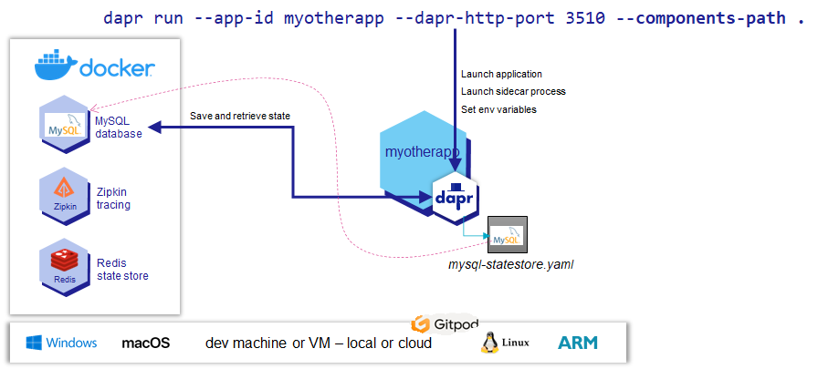

# Exploring Dapr
- [Exploring Dapr](#exploring-dapr)
  - [Inspecting the environment](#inspecting-the-environment)
  - [Getting Started with the Dapr API](#getting-started-with-the-dapr-api)
  - [Using a MySQL Database as a Dapr State Store](#using-a-mysql-database-as-a-dapr-state-store)

In this lab you will have a first introduction to Dapr - the Distributed Application Runtime. You will try out a few very basic operations that leverage the Dapr "personal assistant" to save state and return that state when requested. First the state is saved in a Redis Cache, then with a very simple configuration change, the state is saved in a MySQL database. In the next lab, we will look at using Dapr from a Node application.

## Inspecting the environment

This environment has Dapr installed - both the Dapr CLI (based on [these instructions](https://docs.dapr.io/getting-started/install-dapr-cli/))
and also the Dapr Sidecar binaries (as locally running Docker Containers for Dapr, Redis and Zipkin) (according to [the instructions provided here](https://docs.dapr.io/getting-started/install-dapr-selfhost/))

With

``` 
docker ps
```

you can check on the containers that are running.

With 

```
dapr version
```

you can check the currently installed versions of the CLI and the Dapr Runtime.

The default components configuration is installed in directory `$HOME/.dapr` and the subdirectory `components` . This is where Redis is configured as both the default state store and the default pubsub component.

Check these out with 
```
ls $HOME/.dapr
cat  $HOME/.dapr/config.yaml
cat  $HOME/.dapr/components/statestore.yaml
cat  $HOME/.dapr/components/pubsub.yaml 
```

In the next section, you will leverage this  default state store configuration (Redis). After that, you will override this default with a customized state store (based on MySQL).

## Getting Started with the Dapr API

The dapr run command launches an application, together with a sidecar. Launch a Dapr sidecar that will listen on port 3500 for a blank application named myapp:

```
dapr run --app-id myapp --dapr-http-port 3500
```

Open a new bash terminal. Update the state with an object - a JSON map with *key* set to `name` and the *value* set to `Bruce Wayne`:

```
curl -X POST -H "Content-Type: application/json" -d '[{ "key": "name", "value": "Bruce Wayne"}]' http://localhost:3500/v1.0/state/statestore
```

Retrieve the object you just stored in the state by using the state management API with the key name. In the same terminal window, run the following command:

```
curl http://localhost:3500/v1.0/state/statestore/name 
```

Look in the Redis container and verify Dapr is using it as a state store. Use the Redis CLI with the following command:
```
docker exec -it dapr_redis redis-cli
```

List the Redis keys to see how Dapr created a key value pair with the app-id you provided to dapr run as the key’s prefix:
```
keys *
```

View the state values by running:
```
hgetall "myapp||name"
```

Exit the Redis CLI with:
```
exit
```
and return to the Bash prompt.

In the same terminal window, delete thename state object from the state store.
```
curl -v -X DELETE -H "Content-Type: application/json" http://localhost:3500/v1.0/state/statestore/name
```

## Using a MySQL Database as a Dapr State Store

As was discussed before, Dapr.io supports many different technologies. It provides for example over a dozen implementations of the state store component - each leveraging a different database or cloud storage service. In the previous section we used the out of the Dapr.io box provided Redis Cache as state store. In this step we are going to use a MySQL Database to serve the same purpose.

A MySQL Database is already running in a Docker container called *dapr-mysql*.

To connect to the MySQL server from the MySQL client application from inside the container running MySQL:
```
docker exec -it dapr-mysql mysql -uroot -p
```
and type the password: `my-secret-pw`

You can list the databases:
```
show databases;
```
and create a database and then create tables if you want to.

However, let's not do that right now. Let's configure Dapr to use this MySQL instance to create a database and table to store state in.

Details can be found in the [documentation on the Dapr MySQL State Store building block](https://docs.dapr.io/reference/components-reference/supported-state-stores/setup-mysql/).

The file called `mysql-statestore.yaml` has been predefined. You can find it in directory */workspace/fontys-fall2022-microservices-messaging-kafka-dapr/lab4-exploring-dapr* . It contains this content - which sets up this MySQL instance as a Dapr statestore.

```
apiVersion: dapr.io/v1alpha1
kind: Component
metadata:
  name: durable-statestore
spec:
  type: state.mysql
  version: v1
  metadata:
  - name: connectionString
    value: "root:my-secret-pw@tcp(localhost:3306)/?allowNativePasswords=true"
```

Then run a Dapr sidecar in the terminal as follows:
```
cd /workspace/fontys-fall2022-microservices-messaging-kafka-dapr/lab4-exploring-dapr
dapr run --app-id myotherapp --dapr-http-port 3501 --components-path .
```
Note: if the current directory contains other yaml-files you may see unexpected and unintended effects as Dapr tries to interpret them as well. 

  

This instruction starts a Dapr sidecar (a personal assistant) and instructs the sidecar about a state store called *durable-statestore*. This statestore is backed by a MySQL Database for which the connection details are provided. Now when anyone asks this sidecar to save state and specifies the *durable-statestore* as the state store to use for that request, the Dapr sidecar will know where to go and because of the many built in building blocks in Dapr it also knows what to do in order to talk state affairs with MySQL.

You will find lines like these ones in the logging produced by Dapr when starting up:
```
INFO[0000] Creating MySql schema 'dapr_state_store'      app_id=myotherapp instance=DESKTOP-NIQR4P9 scope=dapr.contrib type=log ver=edge
INFO[0000] Creating MySql state table 'state'            app_id=myotherapp instance=DESKTOP-NIQR4P9 scope=dapr.contrib type=log ver=edge
INFO[0000] component loaded. name: durable-statestore, type: state.mysql/v1  app_id=myotherapp instance=DESKTOP-NIQR4P9 scope=dapr.runtime type=log ver=edge
```
talk to all teams: which data, what level of synchronization required with POS/RAS/…, anonymization of data, multiple stores in test environment? How did KAS do this?
This confirms that Dapr initialized communications with the MySQL instance, it also created the default schema and default table in it for storing state.

Let us now create some state, in exactly the same way as we created state before - when it was saved in Redis Cache.

```
curl -X POST -H "Content-Type: application/json" -d '[{ "key": "name", "value": "Your Own Name"}]' http://localhost:3501/v1.0/state/durable-statestore
```
Note that the portname at which we access the Dapr sidecar is 3501 and the name of the statestore requested is passed in the URL path as well. Let's check if the state was saved. First by retrieving it from the sidecar:
```
curl http://localhost:3501/v1.0/state/durable-statestore/name
```

And next by checking directly in the MySQL Database.

To connect to the MySQL server as you did before, run this next statement that opens the MySQL client in the container running MySQL:
```
docker exec -it dapr-mysql mysql -uroot -p
```
and type the password: `my-secret-pw`

You can list the databases:
```
show databases;
```
and you will notice a database called *dapr_state_store* has been created. 

Use these next statements to switchh to the *dapr_state_store* database, to list all tables and to select all records from the one table *STATE* that Dapr created when it initialized the *durable-statestore* component.

```
use dapr_state_store;
show tables;
select * from state;
```
The last statement returns a result similar to this one:
```
+------------------+-----------------+----------+---------------------+---------------------+--------------------------------------+
| id               | value           | isbinary | insertDate          | updateDate          | eTag                                 |
+------------------+-----------------+----------+---------------------+---------------------+--------------------------------------+
| myotherapp||name | "Your Own Name" |        0 | 2022-03-01 18:00:01 | 2022-03-01 18:00:01 | 0a4d1bb3-e208-4c03-8296-eb9f1a544ff3 |
+------------------+-----------------+----------+---------------------+---------------------+--------------------------------------+
```
Note how the *key* in column *id* is composed of two parts: the name of the application for which the sidecar was managing state concatenated to the actual key you specified. 

The state held in table *STATE* should typically be managed only through Dapr. However, if you were to change the state directly through SQL:
```
update state set value = '"Somebody Else Altogether"';
```
You can exit the mysql client by typing `exit`. This returns you to the command prompt.

You will find that when you ask Dapr for the state held under key *name* it will return the updated value, once again proving that Dapr interacts with MySQL when it comes to state. 
```
curl http://localhost:3501/v1.0/state/durable-statestore/name
```

Just as a manager would like to ask the same questions of their personal assistant when it comes to remembering stuff, regardless of whether the PA writes things down on paper, memorizes them or uses a friend to retain the information, it is a fine thing for application developers to be able to use the same interaction with Dapr regardless of whether state is stored in MySQL, Redis Cache or any of the other types of state store that Dapr supports. In fact, an application developer does not need to know how and where the state will be stored and this can be changed at deployment time as the application administrator sees fit.

Stop the Dapr-ized application. Time to move to the next lab where you will combine Node applications with Dapr to handle interactions. 