# Node using a Dapr Sidecar 


## Getting started with Node and Dapr 

Let us find out how the Dapr sidecar - and the services it can deliver - can be engaged from Node applications. The code discussed in this section are in the directory */lab5-node-and-dapr/hello-world-dapr*.

The Dapr Node SDK will be installed using NPM with this statement executed from the command line in directory *hello-world-dapr*:
```
npm install --save @dapr/dapr
```
Check package.json. It includes the dependency of the Node application on the dapr-client module. The modules themselves are downloaded into the *node-modules* directory, when you execute this command (this one must be executed because otherwise the code will not work):

```
npm install
```
which reads the dependencies in package-lock.json or package.json and downloads and installs all direct (and indirect) dependencies.

File *get-set-get-delete-get.js* gives you a rapid introduction to interaction with Dapr from Node. This program creates a DaprClient - a JavaScript object to interact with the Dapr side car. Then it has the side car look up a piece of state from the statestore, save a new value for the state, retrieve it again and finally remove it altogether.

See this in action by running this next piece of code in a terminal:

```
export DAPR_HTTP_PORT=3590
export APP_PORT=3120
dapr run --app-id dummy --app-port $APP_PORT --dapr-http-port $DAPR_HTTP_PORT node get-set-get-delete-get.js
```

The result will look like this:
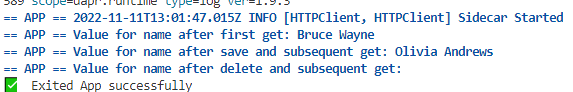  

Let's now turn our attention to something a little more serious: a Node application that accepts HTTP requests and also interacts through Dapr with a statestore.

Open file *app.js* in the editor. It contains a small application that handles HTTP requests: it stores the name passed in the request and stores it as state (in a Dapr state store called *statestore*). It keeps track of the number of occurrences of each name and reports in the HTTP response how many times a name has been mentioned.

The Node application is started through Dapr (using `dapr run --app-id nodeapp node app.js`) and in that way gets its own Dapr sidecar that handles the state related activities. The Node application uses the Node SDK to communicate with the Sidecar - instead of and much more convenient and elegant than explicit HTTP or gRPC interactions.  

This diagram gives an overview of the application.
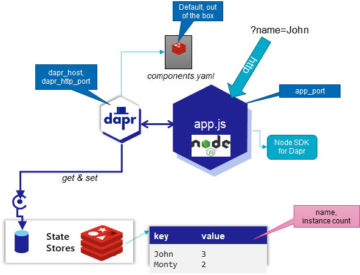

Function *retrieveIncrementSave* is where the real action is when it comes to leveraging the Dapr sidecar. It gets and saves state - without knowing any of the details of the state store (which for now happens to Redis Cache, but could be changed to MySQL or any type of store without any impact on the Node application). The definition of *client* is a crucial linking pin: the client connects the Node application to the Dapr side car.

The application does one other thing of interest: it reads from the state store the value stored under key *instance-sequence-number*. It increases that number (or sets it to 1 if it does not yet occur) and uses it for its own identification. Multiple instances of this application can run - at the same time or at different points in time - and each will have their identification.

Run the application using these commands; Dapr will know the application as *nodeapp*:

```
export DAPR_HTTP_PORT=3510
export APP_PORT=3110
dapr run --app-id nodeapp  --app-port $APP_PORT --dapr-http-port $DAPR_HTTP_PORT node app.js
```
The Gitpod workspace will alert you that two new port are activated: 3510 (for the Dapr sidecar) and 3110 (for the Node application itself). You can ignore this alert. 

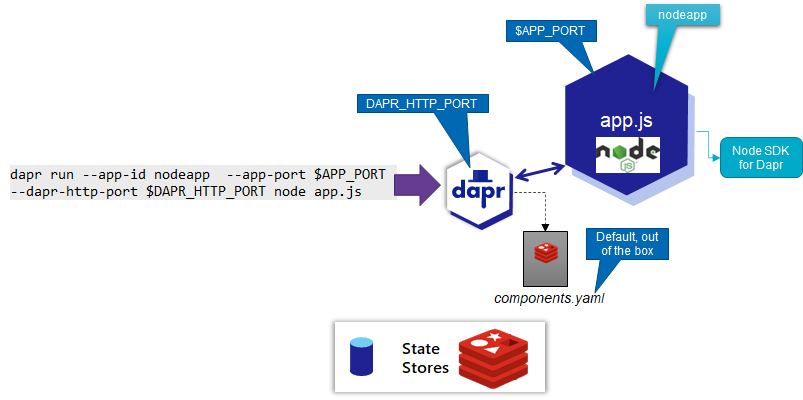  

You will find that the logging from the Sidecar and the Node application appear in the same terminal window. The logging shows the identification number assigned to the currently running instance. It will probably be *one*. If you stop the application and start it again, it should be incremented by one.

Make a request to the application - you will need a second terminal window for this - a plain HTTP request directly to the application. The request as a URL query parameter called *name* and value *Joseph*. The application will process that parameter and put it in the state store through the Dapr sidecar:
```
curl http://localhost:3110/?name=Joseph
```
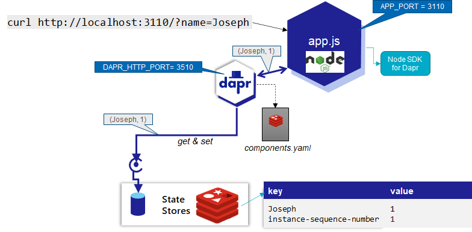  

You will get a response that indicates how often this name has occurred before. Make the same request again and find that the instance count has increased.

A different way to make the request is not directly targetting the Node application and the port it is listening on, but instead to the Dapr sidecar - the application's personal assistant that has responsibility for making sure the request gets to its destination. The sidecar can apply authorization on the request, register telemetry and perform load balancing when multiple instances of the application are  running. In this case, only telemetry is enabled.

The request through the sidecar is standardized into a somewhat elaborate URL:
```
curl localhost:3510/v1.0/invoke/nodeapp/method/?name=Joseph
```

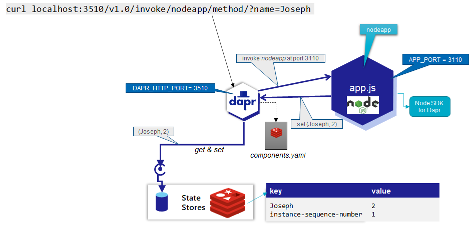  

The first part - *localhost:3510* - refers to the Dapr sidecar and the HTTP port on which it is listening. The next segment - */v1.0/invoke* - identifies the Dapr API's *invoke* operation that we want to access. Subsequently we inform this API through */nodeapp* that we want to interact with the application that Dapr knows as *nodeapp* and we want to pass the URL query parameter *name* with *Joseph* as its value.  

Stop the Node application and its Dapr sidecar. Ctrl+C in the terminal window where you started the application should do the trick. 

Then start the application again. Note: you can use different port numbers for *$APP_PORT* and/or *$DAPR_HTTP_PORT* and everything still works.

```
dapr run --app-id nodeapp  --app-port $APP_PORT --dapr-http-port $DAPR_HTTP_PORT node app.js
```

In a second terminal window, make the same curl call as before:
```
curl localhost:3510/v1.0/invoke/nodeapp/method/?name=Joseph
```
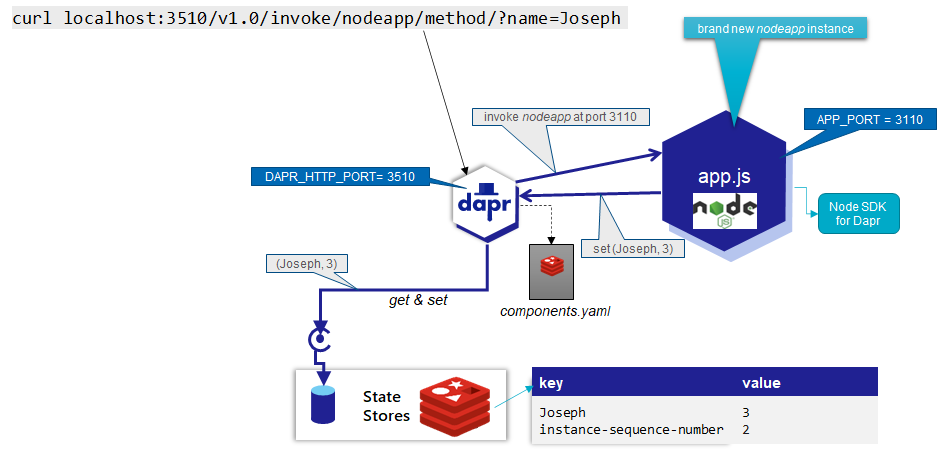  

This should convince you that the state written by the application survives the application. As long as the container with the Redis Cache is running, the state will be available across multiple application restarts and even multiple application instances.

### A second application

We will now add a second application to the mix. It is defined in the file *front-app.js* in directory *hello-world-frontapp*. This application also handles HTTP requests with a name in it. To be honest: it a very flimsy front end that has the *nodeapp* do the real work - such as name counting and state managing. The *frontapp* invokes *nodeapp*. 

Frontapp does not invoke nodeapp directly or even via the nodeapp's sidecar. Instead it asks its own sidecar to make the call to the nodeapp (via the nodeapp's Dapr-application's sidecar) without needing to know where the application runs. 

This diagram visualizes the situation with the two applications and their sidecars.

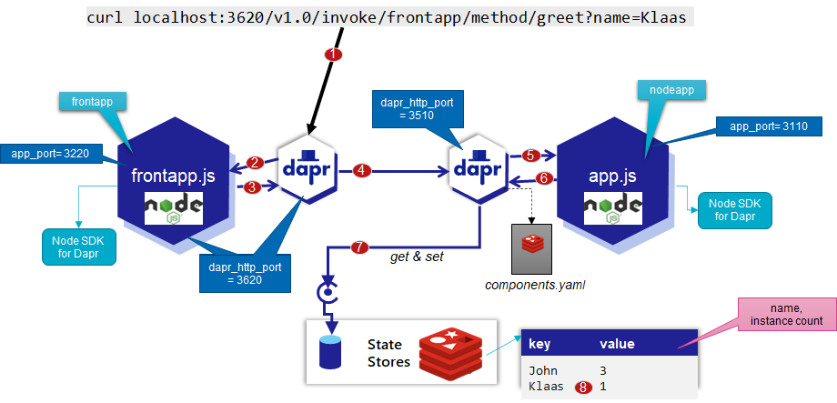  

Start the *frontapp* in a terminal in the *hello-world-frontapp* directory using these commands:
```
npm install --save @dapr/dapr
npm install

export APP_PORT=3220
export DAPR_HTTP_PORT=3620
dapr run --app-id frontapp  --app-port $APP_PORT --dapr-http-port $DAPR_HTTP_PORT node front-app.js
```
Then make a call to the *frontapp* application using curl:
```
curl localhost:3220/?name=Johnny
```
This next call to the *frontapp* through its sidecar is even more decoupled - allowing the frontapp's sidecar to apply authorization, produce telemetry and do load balancing. 
```
curl localhost:3620/v1.0/invoke/frontapp/method/greet?name=Klaas
```

Application *frontapp* has registered with Dapr and should also be known for service discovery to *nodeapp*'s Dapr sidecar, so even this call will work - invoking *frontapp* via the sidecar for *nodeapp*:
```
curl localhost:3510/v1.0/invoke/frontapp/method/greet?name=Klaas
```

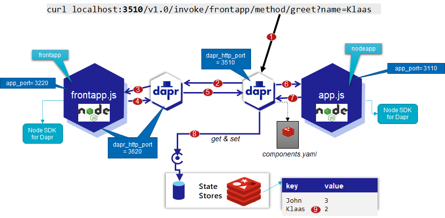  

You should see the name occurrence increase with each call.

Now kill *nodeapp*.

Try:
```
curl localhost:3220/?name=Johnny
```
An exception is reported (because front-could not reach nodeapp). 

Restart *nodeapp*. The application instance number is increased compared to before when you make these calls - into *frontapp* (and indirectly to *nodeapp*) and directly to *nodeapp*: 

```
curl localhost:3620/v1.0/invoke/frontapp/method/greet?name=Klaas

curl localhost:3510/v1.0/invoke/nodeapp/method/?name=Joseph
```
Note that the greeting # keeps increasing: the name and the number times it has occurred is stored as state and persists across application restarts.

## Telemetry, Traces and Dependencies
Open the URL [localhost:9411/](http://localhost:9411/) in your browser. This opens Zipkin, the telemetry collector shipped with Dapr.io. It provides insight in the traces collected from interactions between Daprized applications and via Dapr sidecars. This helps us understand which interactions have taken place, how long each leg of an end-to-end flow has lasted, where things went wrong and what the nature was of each interaction. And it also helps learn about indirect interactions.

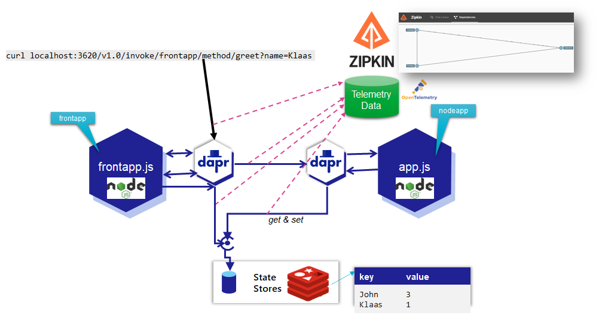  

First check the dependencies that Zipkin had derived. It shows messages flowing from frontapp to nodeapp and from nodeapp to statestore and also from frontapp to statestore. No surprises for us - given our intimate knowledge of the applications ;-).
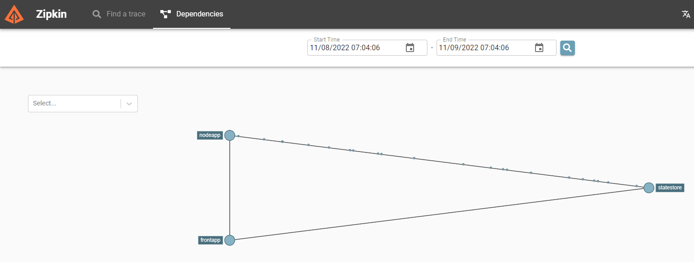  

For someone who does not know these applications or for a much more complex landscape with many more applications and dependencies, such insights can be very valuable. 

How does Zipkin know that frontapp and nodeapp are connected? Of course this is based on information provided by Dapr. Every call made by Dapr Sidecars includes a special header that identifies a trace or conversation. This header is added to interactions to a statestore component and when Dapr sidecars invoke bindings or each other. The sidecar reports to Zipkin that it has performed an action on behalf of its application and it includes the header in that report. Because Zipkin receives traces from all sidecars for all cross boundary interactions, it can construct the overall picture.

Click on the frontapp application node in the dependencies overview to get additional insights in what has been going on:
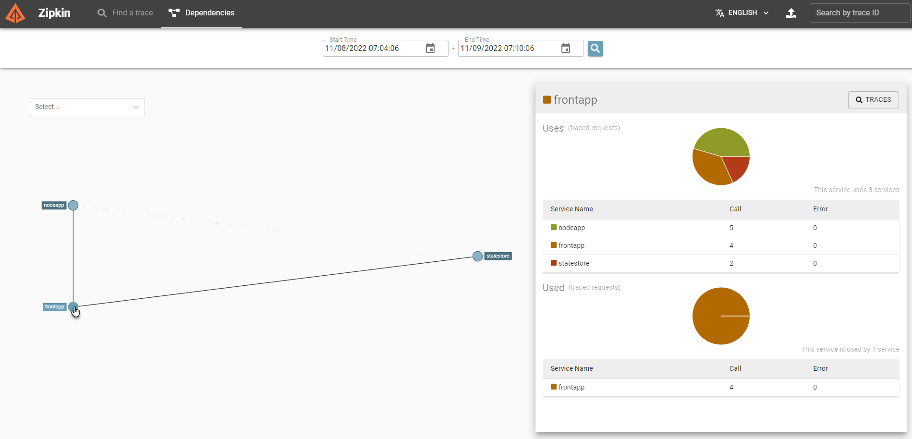.

If you click on the *Traces* button, you will navigate to a page that is primed to query all traces starting at frontapp. Click on the button *Run Query* to query all traces recorded for frontapp.
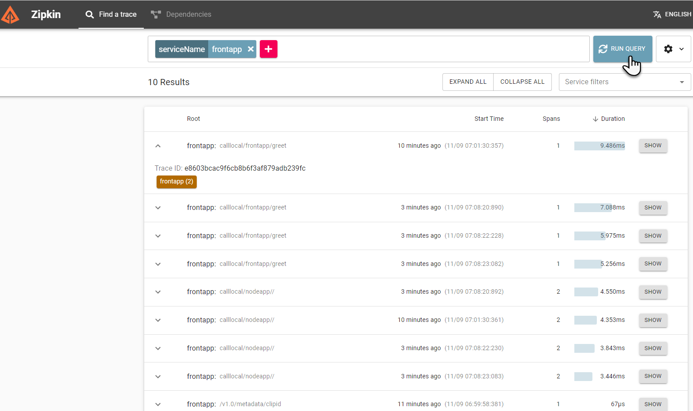  

When you click on a trace with two spans - you will see how these two relate - and how much time of the parent span was actually taken up by the nested span. In this case, most of the time we were waiting for frontapp, we were in reality waiting for nodeapp.

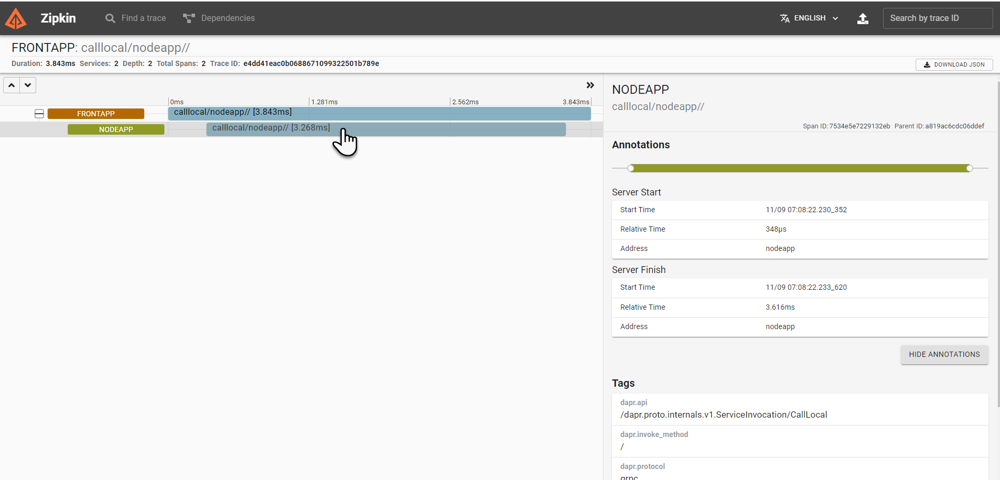  

You can also filter on traces that take longer than a specific period and in that way find performance problems. 


## Next step: Decoupling Applications using Asynchronous Interaction with Dapr Pub/Sub support 

It is not ideal that frontapp depends on nodeapp in this way, and has to report an exception when nodeapp is not available.

We will make some changes to remove this dependency:
* *frontapp* will publish a message to a pub/sub component (in Dapr, this is by default implemented on Redis)
* *nodeapp* will consume messages from the pub/sub component and will write the name to the state store and increase the occurrence count
* *frontapp* will no longer get information from *nodeapp*; it will read directly from the state store; however: it will not write to the state store, that is still the responsibility and prerogative only of *nodeapp*. 

Stop all running applications before starting the next section.

Then open the *readme.md* document in directory *lab6-node-and-dapr-async*


## Resources

[Dapr Docs - State Management](https://docs.dapr.io/developing-applications/building-blocks/state-management/state-management-overview/)
[Dapr Docs - Distributed Tracing](https://docs.dapr.io/developing-applications/building-blocks/observability/tracing-overview/)

