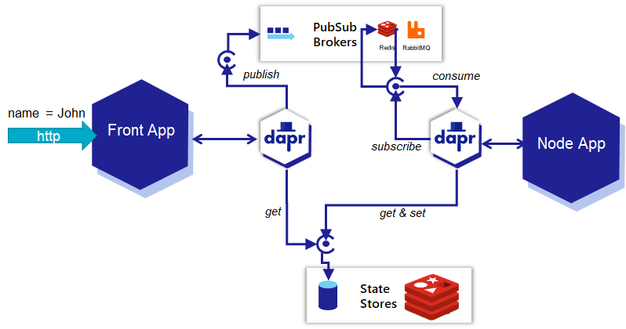
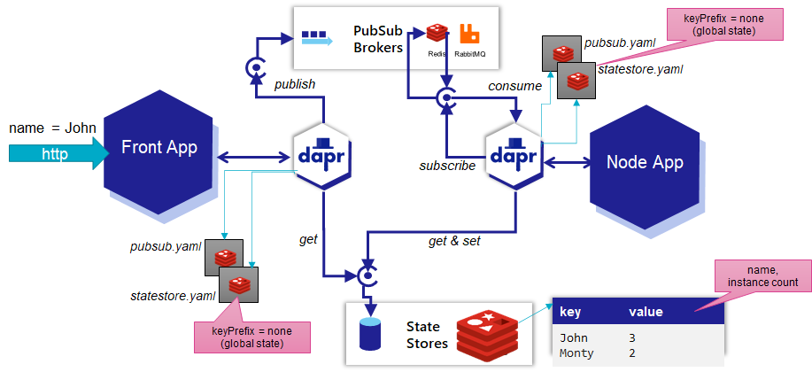

# Node and Dapr - Asynchronous Interactions 


Open the *readme.md* document in directory *lab6-node-and-dapr-async*

## Node and Dapr - Pub/Sub for Asynchronous Communications

Focus now on folder *hello-world-async-dapr*. It contains the app.js and front-app.js files that we have seen before - but they have been changed to handle asynchronous communications via the built in Pub/Sub support in Dapr based in this case on the out of the box Redis based message broker.

Run 
```
npm install
```
to have the required npm modules loaded to the *node-modules* directory.

Check file *~/.dapr/components/pubsub.yaml* to see how the default Pub/Sub component is configured. It gives a fairly good idea about how other brokers could be configured with Dapr, brokers such as RabbitMQ or Apache Kafka.
```
cat ~/.dapr/components/pubsub.yaml
```
The name of the component is *pubsub* and its type is *pubsub.redis*. Daprized applications will only mention the name (*pubsub*) when they want to publish or consume messages, not refer to *redis* in any way. They do not know about the *redis* subtype and if it changes (when for example a Pulsar or Hazelcast message broker is introduced), they are not impacted.

Inspect the file *consumer.js* that contains a Dapr-based message consumer application. This application constructs a Dapr Server - an object that received requests from the Dapr Sidecar. Before, we saw the Dapr Client, that is used for sending instructions to the Sidecar.

Using this DaprServer, a subscription is created for messages on topic *orders* on pubsub component *pubsub*. This subscription is provided an anonymous and asynchronous handler function that will be invoked for every message the Sidecar retrieves from the message topic. 

Run the simple sample message consuming application *order-processor*:
```
export APP_PORT=6002
export DAPR_HTTP_PORT=3602
dapr run --app-id order-processor --app-port $APP_PORT --dapr-http-port $DAPR_HTTP_PORT --dapr-grpc-port 60002 node consumer.js
```

Check the logging to find that the application is listening on HTTP port 6002 to receive any messages that the Dapr sidecar (the personal assistant to the application) may pick up based on the topic subscription.

This diagram visualizes the current situation:


To publish a message to the *orders* topic in the default *pubsub* component, run this CLI command:
```
dapr publish --publish-app-id order-processor --pubsub pubsub --topic orders --data '{"orderId": "100"}' 
```
This tells Dapr to publish a message on behalf of an application with id *order-processor* (which is the application id of the only Dapr sidecar currently running) to the pubsub component called *pubsub* and a topic called *orders*. 

Check in the logging from the consumer application if the message has been handed over by the Dapr sidecar to the application (after consuming it from the topic on the pubsub component).

### Publishing from Node

The publisher application *orderprocessing* is a simple Node application that sends random messages to the *orders* topic on *pubsub*. Check the file *publisher.js*.  It creates a Dapr client - the connection from Node application to the Sidecar - and uses the *pubsub.publish* method on the client to publish messages to the specified TOPIC on the indicated PUBSUB component. Through the Dapr component definitions (yaml files), multiple pubsub components (backed by the same or by different providers such as Redis, RabbitMQ, Hazelcast) can be defined, each with their own name. The default components file contains the *pubsub* component, backed by Redis Cache.

Run the application with the following statement, and check if the messages it produces reach the consumer:

```
export APP_PORT=6001
export DAPR_HTTP_PORT=3601
dapr run --app-id orderprocessing --app-port $APP_PORT --dapr-http-port $DAPR_HTTP_PORT node publisher.js 
```
The publisher application is started and publishes all it has to say - to its Dapr Sidecar. This loyal assistant publishes the messages onwards, to what we know is the Redis Pub/Sub implementation.

This diagram puts it into a picture:


These messages are consumed by the *consumer* app's Sidecar because of its subscription on the *orders* topic. For each message, a call is made to the handler function. 

Check the logging in the terminal window where the *consumer* app is running. You should see log entries for the messages received. Note that the messages in the log on the receiving end are not in the exact same order as they were sent in. They are delivered in the original order and each is processed in its own instance of the handler function. Since the messages in this case arrive almost at the same time and the processing times for the messages can vary slightly, the order of the log messages is not determined. 

Stop the consumer application. 

Run the publisher application again. Messages are produced. And they are clearly not received at this point because the consumer is not available for consuming them. Are these messages now lost? Has communication broken down?

Start the consumer application once more to find out:
```
export APP_PORT=6002
export DAPR_HTTP_PORT=3602
dapr run --app-id order-processor --app-port $APP_PORT --dapr-http-port $DAPR_HTTP_PORT node consumer.js
```

You should see that the messages published by the publisher application when the consumer was stopped are received by the consumer now that it is running again. This is a demonstration of asynchronous communication: two applications exchange messages through a middle man - the pubsub component - and have no dependency between them.  

The handshake between Dapr sidecar and pubsub component on behalf of the consumer is identified through the app-id. Messages are delivered only once to a specific consumer. When a new consumer arrives on the scene - with an app-id that has not been seen before - it will receive all messages the queue is still retaining on the topic in question.

Stop the consumer application.

Start the consumer application *with a new identity* - defined by the *app-id* parameter: 
```
dapr run --app-id new-order-processor --app-port $APP_PORT --dapr-http-port $DAPR_HTTP_PORT node consumer.js
```
and watch it receive all earlier published messages. 

## Leverage Dapr Pub/Sub between Front App and Node App
As was discussed before, we want to break the synchronous dependency in the front-app on the node-app. To achieve this, we will make these changes:
* the frontapp will publish a message to the *names* topic on the default pub/sub component 
* the nodeapp will consume messages from this *names* topic on the pub/sub component and will write the name from each message it consumes to the state store and increase the occurrence count for that name
* the frontapp will no longer get information from synchronous calls to the nodeapp; it will read directly the occurrence count for a name from the state store; however: it will not write to the state store, that is the task for nodeapp. 

Here we see a very simplistic application of the *CQRS* pattern where we segregate the responsibility for reading from a specific data set and writing data in that set.

The front-app.js file is changed compared to the earlier implementation:
* publish a message to the *names* topic on *pubsub* for every HTTP request that is processed
* retrieve the current count for the name received in an HTTP request from the state store (assume zero if the name does not yet occur) and use the name count increased by one in the HTTP response  

The Dapr client is used for both publishing the message and for retrieving state. The direct call from *front-app.js* to the (other) Node application has been removed.

Run the *frontapp* with these statements:

```
export APP_PORT=6030
export DAPR_HTTP_PORT=3630
dapr run --app-id greeter --app-port $APP_PORT --dapr-http-port $DAPR_HTTP_PORT node front-app.js 
```
Check in the logging that the application was successfully started.

Make a number of calls that will be handled by the front-app:
```
curl localhost:6030?name=Jonathan
curl localhost:6030?name=Jonathan
curl localhost:6030?name=Jonathan
```
You will notice that the number of occurrences of the name is not increasing. The reason: the *frontapp* cannot write to the state store and the application that should consume the messages from the pubsub's topic is not yet running and therefore not yet updating the state store. Here is an overview of the situation right now:
  

So let's run this *name-processor* using these statements:
 
```
export APP_PORT=6031
export SERVER_PORT=6032
export DAPR_HTTP_PORT=3631
dapr run --app-id name-processor --app-port $APP_PORT --dapr-http-port $DAPR_HTTP_PORT node app.js 
```
The logging for this application should show that the messages published earlier by *frontapp* are now consumed, and the statestore is updated. 

Here is the situation in a picture:


Note: this implementation is not entirely safe because multiple instances of the handler function, each working to process a different message, could end up in *race conditions* where one instance reads the value under a key from the state store, increases it and saves it. However, a second instance could have read the value right after or just before and do its own increment and save action. After both are done, the name occurrence count may be increased by one instead of two. For the purpose of this lab, we accept this possibility.    

Make a number of calls that will be handled by the front-app:
```
curl localhost:6030?name=Jonathan
curl localhost:6030?name=Jonathan
curl localhost:6030?name=Jonathan
```
You will notice that the number of occurrences of the name is (still) not increasing. However, when you check the logging for the name-processor, you should also see that it is triggered by an event that contains the name *Jonathan* and it is keeping correct count. So whay does the front-app not produce the same number of occurrences?

This has to do with different modes of operation of the Dapr state store. By default, every application has its own private area within the state store. Values stored by one application are not accessible to other applications. In this example, *name-processor* records the name and the occurence count. And when the front-app retrieves the entry for the name from the state store, it will not find it (in its own private area).

We can instruct Dapr to use a state store as a global, shared area that is accessible to all applications.  See [Dapr Docs on global state store](https://docs.dapr.io/developing-applications/building-blocks/state-management/howto-share-state/).

Copy the default state store component configuration to the local directory, as well as the *pubsub* component configuration: 
```
cp ~/.dapr/components/statestore.yaml .
cp ~/.dapr/components/pubsub.yaml .
```
Check the contents of the file that specifies the state store component:
```
cat statestore.yaml
```
You see how the state store component is called *statestore* and is of type *state.redis*. Now edit the file and add a child element under metadata in the spec (at the same level as redisHost):
```
  - name: keyPrefix
    value: none  # none means no prefixing. Multiple applications share state across different state stores
```
This setting instructs Dapr to treat keys used for accessing state in the state store as global keys - instead of application specific keys that are automatically prefixed with the application identifier.

Save the file.

Stop both the frontapp and the name-processor applications.

Start both applications - with the added components-path parameter as shown below. This parameter tells Dapr to initialize components as defined by all the yaml files in the indicated directory (in this case the current directory). That is why you had to copy the pubsub.yaml file as well to the current directory, even though it is not changed. If you would not, it is not found by Dapr and call attempts to publish messages to topics on *pubsub* or subscribe to such topics will fail.



In one terminal, start the *greeter* application:
```
export APP_PORT=6030
export DAPR_HTTP_PORT=3630
dapr run --app-id greeter --app-port $APP_PORT --dapr-http-port $DAPR_HTTP_PORT --components-path .  node front-app.js 
```
and in a second terminal run *name-processor*:
```
export APP_PORT=6031
export SERVER_PORT=6032
export DAPR_HTTP_PORT=3631
dapr run --app-id name-processor --app-port $APP_PORT --dapr-http-port $DAPR_HTTP_PORT --components-path . node app.js 
```

Again, make a number of calls that will be handled by the front-app:
```
curl localhost:6030?name=Michael
curl localhost:6030?name=Michael
curl localhost:6030?name=Michael
curl localhost:6030?name=Jonathan
```
At this point, the front-app should get the increased occurrence count from the state store, saved by the name-processor app, because now both apps work against the global shared state store. 

## Telemetry, Traces and Dependencies
Open the URL [localhost:9411/](http://localhost:9411/) in your browser. This opens Zipkin, the telemetry collector shipped with Dapr.io. It provides insight in the traces collected from interactions between Daprized applications and via Dapr sidecars. This helps us understand which interactions have taken place, how long each leg of an end-to-end flow has lasted, where things went wrong and what the nature was of each interaction. And it also helps learn about indirect interactions.


Query Zipkin for traces. You should find traces that start at *greeter* and also include *name-processor*. You now that we have removed the dependency from *greeter* on *name-processor* by having the information flow via the pubsub component. How does Zipkin know that greeter and name-processor are connected? Of course this is based on information provided by Dapr. Every call made by Dapr Sidecars includes a special header that identifies a trace or conversation. This header is added to messages published to a pubsub component and when a Dapr sidecar consumes such a message, it reads the header value and reports to Zipkin that it has processed a message on behalf of its application and it includes the header in that report. Because Zipkin already received that header when the Dapr sidecar that published the message (on behalf of the greeter application) reported its activity, Zipkin can construct the overall picture.

When you go to the Dependencies tab in Zipkin, you will find a visual representation of the dependencies Zipkin has learned about. Granted, there are not that many now, but you can imagine how this type of insight in a complex network of microservices could add useful insights.

## Resources

[Dapr Docs - Pub/Sub](https://docs.dapr.io/developing-applications/building-blocks/pubsub/pubsub-overview/)
[Dapr Docs - State Management](https://docs.dapr.io/developing-applications/building-blocks/state-management/state-management-overview/)
[Dapr Docs - Shared State between Applications](https://docs.dapr.io/developing-applications/building-blocks/state-management/state-management-overview/#shared-state-between-applications)


