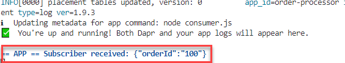
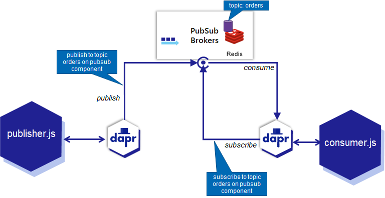
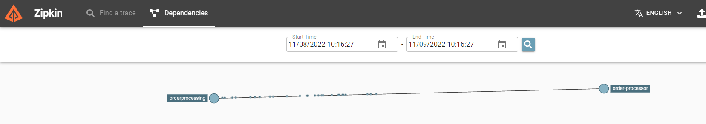
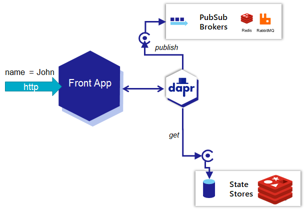
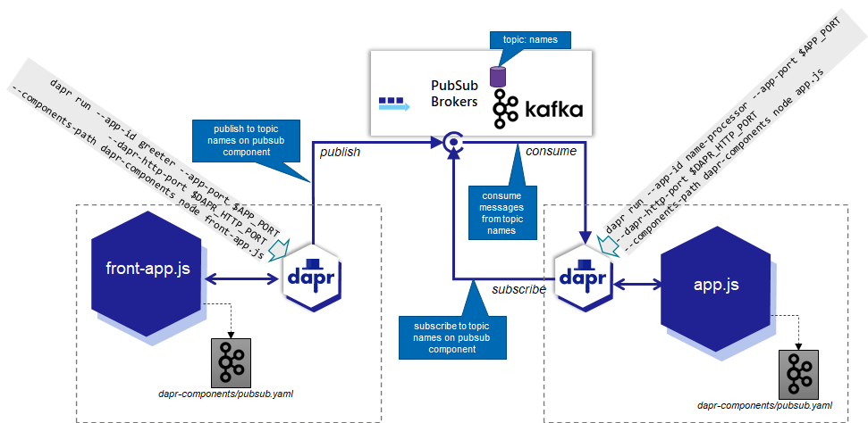
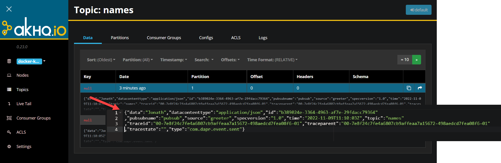
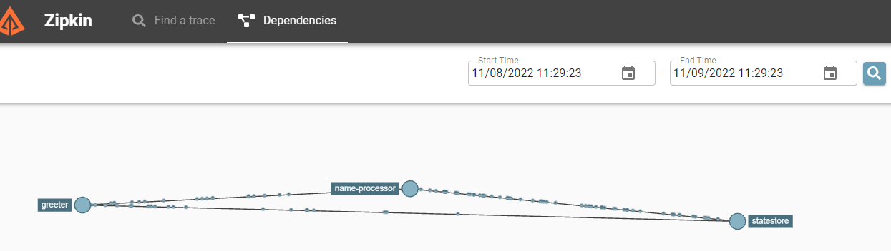
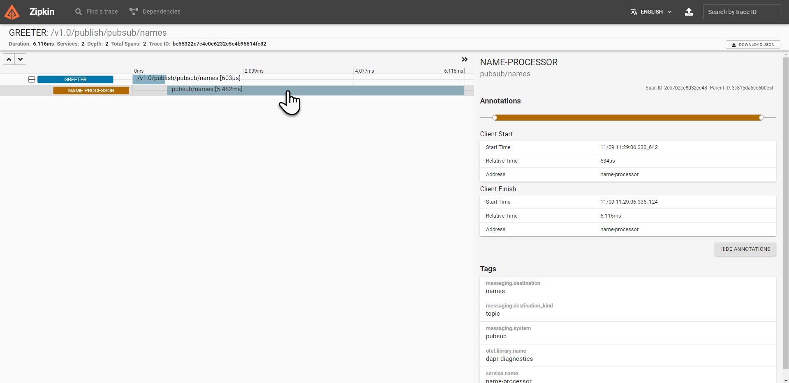

# Node and Dapr - Asynchronous Interactions 

In this section we will look at how Dapr helps us with asynchronous interactions aka the pubsub pattern. Dapr hides most of the complexity and all of the pubsub technology specific details. The Dapr sidecar takes care of delivering a message to the message handling component as well subscribing to such a component and invoking the endpoint that handles the consumed messages.

We will first use the default Dapr pubsub implementation - which is Redis - to decouple frontapp and nodeapp. Then, with very little effort, we will switch to Apache Kafka as the messaging platform.

## Node and Dapr - Pub/Sub for Asynchronous Communications

Focus now on folder *hello-world-async-dapr*. It contains the app.js and front-app.js files that we have seen before - but they have been changed to handle asynchronous communications via the built in Pub/Sub support in Dapr based in this case on the out of the box Redis based message broker.

Open a terminal and switch to the directory:
```
cd /workspace/fontys-fall2022-microservices-messaging-kafka-dapr/lab6-node-and-dapr-async/simple-order-pubsub
npm install
```
to have the required npm modules loaded to the *node-modules* directory.

Check file *~/.dapr/components/pubsub.yaml* to see how the default Pub/Sub component is configured. It gives a fairly good idea about how other brokers could be configured with Dapr, brokers such as RabbitMQ or Apache Kafka.
```
cat ~/.dapr/components/pubsub.yaml
```
The name of the component is *pubsub* and its type is *pubsub.redis*. Daprized applications will only mention the name (*pubsub*) when they want to publish or consume messages, not refer to *redis* in any way. They do not know about the *redis* subtype and if it changes (when for example a Pulsar or Hazelcast message broker is introduced), they are not impacted.

Inspect the file *consumer.js* that contains a Dapr-based message consumer application. This application constructs a Dapr Server - an object that receives requests *from* the Dapr Sidecar. Before, we saw the Dapr Client, that is used for sending instructions *to* the Sidecar.

Using this DaprServer, a subscription is created for messages on topic *orders* on pubsub component *pubsub*. This subscription is provided an anonymous and asynchronous handler function that will be invoked for every message the Sidecar retrieves from the message topic. 

Run the simple sample message consuming application *order-processor*:
```
export APP_PORT=6002
export DAPR_HTTP_PORT=3602
dapr run --app-id order-processor --app-port $APP_PORT --dapr-http-port $DAPR_HTTP_PORT --dapr-grpc-port 60002 node consumer.js
```

Check the logging to find that the application is listening on HTTP port 6002 to receive any messages that the Dapr sidecar (the personal assistant to the application) may pick up based on the topic subscription.

This diagram visualizes the current situation:


To publish a message to the *orders* topic in the default *pubsub* component, run this CLI command in new terminal window:
```
dapr publish --publish-app-id order-processor --pubsub pubsub --topic orders --data '{"orderId": "100"}' 
```
This tells Dapr to publish a message on behalf of a imaginary application called *order-processor* (which is the application id of the only Dapr sidecar currently running) to the pubsub component called *pubsub* and a topic called *orders*. 

Check in the logging from the consumer application if the message has been handed over by the Dapr sidecar to the application (after consuming it from the topic on the pubsub component).

  

### Publishing from Node

The publisher application *orderprocessing* is a simple Node application that sends random messages to the *orders* topic on *pubsub*. Check the file *publisher.js*.  It creates a Dapr client - the connection from Node application to the Sidecar - and uses the *pubsub.publish* method on the client to publish messages to the specified TOPIC on the indicated PUBSUB component. Through the Dapr component definitions (yaml files), multiple pubsub components (backed by the same or by different providers such as Redis, RabbitMQ, Hazelcast) can be defined, each with their own name. The default components file contains the *pubsub* component, backed by Redis Cache.

```
metadata:
  name: pubsub
spec:
  type: pubsub.redis
  version: v1
  metadata:
  - name: redisHost
    value: localhost:6379
  - name: redisPassword
    value: ""
```    

Run the producer application with the following statement, and check if the messages it produces reach the consumer:

```
cd /workspace/fontys-fall2022-microservices-messaging-kafka-dapr/lab6-node-and-dapr-async/simple-order-pubsub
export APP_PORT=6001
export DAPR_HTTP_PORT=3601
dapr run --app-id orderprocessing --app-port $APP_PORT --dapr-http-port $DAPR_HTTP_PORT node publisher.js 
```
The publisher application is started and publishes all it has to say - to its Dapr Sidecar (simple integer values with a five-second internal). This loyal assistant publishes the messages onwards, to what we know is the Redis Pub/Sub implementation.

This diagram puts it into a picture:


These messages are consumed by the *consumer* app's Sidecar because of its subscription on the *orders* topic. For each message, a call is made to the handler function. 

Check the logging in the terminal window where the *consumer* app is running. You should see log entries for the messages received. 

Stop the consumer application. 

Run the publisher application again. Messages are produced. And they are clearly not received by the consumer application at this point because it is not available for consuming them. Are these messages now lost? Has communication broken down?

Start the consumer application once more to find out:
```
export APP_PORT=6002
export DAPR_HTTP_PORT=3602
dapr run --app-id order-processor --app-port $APP_PORT --dapr-http-port $DAPR_HTTP_PORT node consumer.js
```

You should see that the messages published by the publisher application when the consumer was stopped are received by the consumer now that it is running again. This is a demonstration of asynchronous communication: two applications exchange messages through a middle man - the pubsub component - and have no dependency between them. Note: all the messages are processed at almost the same time by different instances of the anonymous handler function running in parallel. This may result in the output from these functions being sent to the console in a different order than the original publication sequence of these messages.  

The handshake between Dapr sidecar and pubsub component on behalf of the consumer is identified through the app-id. Messages are delivered only once to a specific consumer. When a new consumer arrives on the scene - with an app-id that has not been seen before - it will receive all messages the queue is still retaining on the topic in question.

Stop the consumer application.

Start the consumer application *with a new identity* - defined by the *app-id* parameter: 
```
dapr run --app-id new-order-processor --app-port $APP_PORT --dapr-http-port $DAPR_HTTP_PORT node consumer.js
```
and watch it receive all earlier published messages - again most probably in a different order than the original publication order. 

### Quick Peek at telemetry

Open the URL localhost:9411/ in your browser. This once more opens Zipkin, the telemetry collector shipped with Dapr.io. It provides insight in the traces collected from interactions between Daprized applications and via Dapr sidecars, also when these interactions are asynchronous through a pubsub component. Open the Dependencies tab and query for dependencies. You will see something similar to the following image. Note: if you are fast enough, you will also see *new-order-processor* linked from "orderprocessing"

  

A dependency is presented between orderprocessing (the application id for the process started from publisher.js) and order-processor (the app id for the process started from consumer.js). We intuitively agree with this dependency. However, there is no explicit link between publisher.js and consumer.js. It was derived from the traces that the Dapr sidecars for orderprocessing (publisher.js) and order-processor (consumer.js) have published to Zipkin. 

Again, for someone who does not know the application and the flow of information, this insight can be quite valuable!

## Leverage Dapr Pub/Sub between Front App and Node App

As was discussed before, we want to break the synchronous dependency in the front-app on the node-app. To achieve this, we will make these changes:
* the frontapp will publish a message to the *names* topic on the pub/sub component called *pubsub* 
* the nodeapp will consume messages from this *names* topic on the *pubsub* pub/sub component and will write the name from each message it consumes to the state store and increase the occurrence count for that name
* the frontapp will no longer get information from synchronous calls to the nodeapp; it will read directly the occurrence count for a name from the state store; however: it will not write to the state store, that is the task for nodeapp. 

Here we see a very simplistic application of the *CQRS* pattern where we segregate the responsibility for reading from a specific data set and writing data in that set.

The front-app.js file is changed compared to the earlier implementation:
* publish a message to the *names* topic on *pubsub* for every HTTP request that is processed
* retrieve the current count for the name received in an HTTP request from the state store (assume zero if the name does not yet occur) and add one to the value when composing the HTTP response (because the value retrieved from the statestore does not yet include the current request itself)  

The Dapr client is used for both publishing the message and for retrieving state. The direct call from *front-app.js* to the (other) Node application has been removed.

Run the *frontapp* with these statements:

```
cd /workspace/fontys-fall2022-microservices-messaging-kafka-dapr/lab6-node-and-dapr-async/hello-world-async-dapr
npm install 
export APP_PORT=6030
export DAPR_HTTP_PORT=3630
dapr run --app-id greeter --app-port $APP_PORT --dapr-http-port $DAPR_HTTP_PORT node front-app.js 
```
Check in the logging that the application was successfully started.

Make a number of calls that will be handled by the front-app:
```
curl localhost:6030?name=Jonathan
curl localhost:6030?name=Jonathan
curl localhost:6030?name=Jonathan
```
You will notice that the number of occurrences of the name is not increasing. The reason: the *frontapp* cannot write to the state store and the application that should consume the messages from the pubsub's topic is not yet running and therefore not yet updating the state store. Here is an overview of the situation right now:

  

So let's run this *name-processor* using these statements:
 
```
cd /workspace/fontys-fall2022-microservices-messaging-kafka-dapr/lab6-node-and-dapr-async/hello-world-async-dapr
export APP_PORT=6031
export SERVER_PORT=6032
export DAPR_HTTP_PORT=3631
dapr run --app-id name-processor --app-port $APP_PORT --dapr-http-port $DAPR_HTTP_PORT node app.js 
```

The logging for this application should show that the messages published earlier by *frontapp* are now consumed, and the statestore is updated. 

Here is the situation in a picture:


Note: this implementation is not entirely safe because multiple instances of the handler function, each working to process a different message, could end up in *race conditions* where one instance reads the value under a key from the state store, increases it and saves it. However, a second instance could have read the value right after or just before and do its own increment and save action. After both are done, the name occurrence count may be increased by one instead of two. For the purpose of this lab, we accept this possibility.    

Make a number of calls that will be handled by the front-app:
```
curl localhost:6030?name=Jonathan
curl localhost:6030?name=Jonathan
curl localhost:6030?name=Jonathan
```
You will notice that the number of occurrences of the name is (still) not increasing. However, when you check the logging for the name-processor, you should also see that it is triggered by an event that contains the name *Jonathan* and it is keeping correct count. So whay does the front-app not produce the same number of occurrences?

This has to do with different modes of operation of the Dapr state store. By default, every application has its own private area within the state store. Values stored by one application are not accessible to other applications. In this example, *name-processor* records the name and the occurence count. And when the front-app retrieves the entry for the name from the state store, it will not find it (in its own private area).

We can instruct Dapr to use a state store as a global, shared area that is accessible to all applications.  See [Dapr Docs on global state store](https://docs.dapr.io/developing-applications/building-blocks/state-management/howto-share-state/).

Directory *lab6-node-and-dapr-async/hello-world-async-dapr/dapr-components* contains files *statestore.yaml* and *pubsub.yaml*, copied from directory *~/.dapr/components* .

Check the contents of the file that specifies the state store component: `statestore.yaml`.

You see how the state store component is called *statestore* and is of type *state.redis*. The state store component has a child element under metadata in the spec (at the same level as redisHost):
```
  - name: keyPrefix
    value: none  # none means no prefixing. Multiple applications share state across different state stores
```

This setting instructs Dapr to treat keys used for accessing state in the state store as global keys - instead of application specific keys that are automatically prefixed with the application identifier. 

At this moment, the applications are running with the default statestore definition (in *~/.dapr/components*). To use the definition provided here, we have to run the Dapr sidecar with an instruction to use the Dapr component configurations in the application directory.

Stop both the frontapp and the name-processor applications.

Start both applications - with the added *components-path* parameter as shown below. This parameter tells Dapr to initialize components as defined by all the yaml files in the indicated directory (in this case the current directory). That is why you had to copy the pubsub.yaml file as well to the current directory, even though it is not changed. If you would not, it is not found by Dapr and call attempts to publish messages to topics on *pubsub* or subscribe to such topics will fail.


In one terminal, start the *greeter* application:
```
export APP_PORT=6030
export DAPR_HTTP_PORT=3630
dapr run --app-id greeter --app-port $APP_PORT --dapr-http-port $DAPR_HTTP_PORT --components-path dapr-components  node front-app.js 
```
and in a second terminal run *name-processor*:
```
export APP_PORT=6031
export SERVER_PORT=6032
export DAPR_HTTP_PORT=3631
dapr run --app-id name-processor --app-port $APP_PORT --dapr-http-port $DAPR_HTTP_PORT --components-path dapr-components node app.js 
```

Again, make a number of calls that will be handled by the front-app:
```
curl localhost:6030?name=Michael
curl localhost:6030?name=Michael
curl localhost:6030?name=Michael
curl localhost:6030?name=Jonathan
```
At this point, the front-app should get the increased occurrence count from the state store, saved by the name-processor app, because now both apps work against the global shared state store. 


## Switch PubSub provider from Redis to Apache Kafka

And now at last we get back to Apache Kafka. In the previous section we have done asynchronous microservice interaction using Dapr pubsub - powered by Redis as the message backbone. However, we want Apache Kafka to be our underlying message infrastructure. And we already have the three-broker-cluster running (which you can verify through `docker ps` or by inspecting the AKHQ UI in the brower for port `28042`.

Replace the contents of file `pubsub.yaml` (in directory *lab6-node-and-dapr-async/hello-world-async-dapr/dapr-components*) with the following, in order to have pub/sub component *pubsub* provided by Apache Kafka instead of Redis:

```
apiVersion: dapr.io/v1alpha1
kind: Component
metadata:
  name: pubsub
  namespace: default
spec:
  type: pubsub.kafka
  version: v1
  metadata:
  - name: brokers # Required. Kafka broker connection setting
    value: "localhost:29092,localhost:29093,localhost:29094"
  - name: authType # Required.
    value: "none"
  - name: authRequired
    value: "false"
```   

Note: the name is the same as before (*pubsub*). The type is changed, from pubsub.redis to pubsub.kafka. And the metadata for this type is Kafka specific - and indicates the brokers in the Kafka-cluster. Note: see [Dapr Docs](https://docs.dapr.io/reference/components-reference/supported-pubsub/setup-apache-kafka/) for all settings

Our code - in `app.js` and `front-app.js` - does not need to know about this change in Pub/Sub provider. These modules communicate with the sidecars in generic pub/sub terms - without specific reference to Kafka or Redis. Before we can run the code, we need to make that the topic that the code expects to be dealing with - *names* - exists on the Kafka Cluster. 

You can create the topic through the AKHQ web UI or through the Kafka CLI Tool:
```
docker exec -ti kafka-1 bash
kafka-topics --create --if-not-exists --zookeeper zookeeper-1:2181 --topic names --partitions 3 --replication-factor 2
exit
```

Stop the two applications - greeter and name-processor - and the start them again. This time - because of the changed pubsub.yaml file - they - or rather their sidecars - will hook up with Apache Kafka.

In one terminal, start the *greeter* application:
```
export APP_PORT=6030
export DAPR_HTTP_PORT=3630
dapr run --app-id greeter --app-port $APP_PORT --dapr-http-port $DAPR_HTTP_PORT --components-path dapr-components  node front-app.js 
```
and in a second terminal run *name-processor*:
```
export APP_PORT=6031
export SERVER_PORT=6032
export DAPR_HTTP_PORT=3631
dapr run --app-id name-processor --app-port $APP_PORT --dapr-http-port $DAPR_HTTP_PORT --components-path dapr-components node app.js 
```

This image shows the current set up. Two independent applications with their sidecars - both interacting with Apache Kafka. In both cases, our custom code only has a dependency on Dapr - not on Redis or Kafka. 

  

Invoke the greeter application a few times. 

Again, make a number of calls that will be handled by the front-app:
```
curl localhost:6030?name=Mary
curl localhost:6030?name=Michael
curl localhost:6030?name=Michael
curl localhost:6030?name=Mary
curl localhost:6030?name=Jonathan
```

This will result in responses - and in some messages on the new Kafka Topic *names*. You can inspect the contents of the topic in AKHQ in the browser. The next image demonstrates what this looks like - and what the message contents is. Note data used for constructing the trace information published to Zipkin.

  


## Telemetry, Traces and Dependencies
Open the URL [localhost:9411/](http://localhost:9411/) in your browser. This opens Zipkin, the telemetry collector shipped with Dapr.io. It provides insight in the traces collected from interactions between Daprized applications and via Dapr sidecars. This helps us understand which interactions have taken place, how long each leg of an end-to-end flow has lasted, where things went wrong and what the nature was of each interaction. And it also helps learn about indirect interactions.


Query Zipkin for Dependencies. You will see the link from greeter to name-processor. 
  

You know that we have removed the dependency from *greeter* on *name-processor* by having the information flow via the pubsub component. How does Zipkin know that greeter and name-processor are connected? Of course this is based on information provided by Dapr. Every call made by Dapr Sidecars includes a special header that identifies a trace or conversation. This header is added to messages published to a pubsub component and when a Dapr sidecar consumes such a message, it reads the header value and reports to Zipkin that it has processed a message on behalf of its application and it includes the header in that report. Because Zipkin already received that header when the Dapr sidecar that published the message (on behalf of the greeter application) reported its activity, Zipkin can construct the overall picture.

When inspecting the traces, you will find two-level traces for greeter and nested name-processor, such as the one shown here:

  

## Resources

[Dapr Docs - Pub/Sub](https://docs.dapr.io/developing-applications/building-blocks/pubsub/pubsub-overview/)
[Dapr Docs - State Management](https://docs.dapr.io/developing-applications/building-blocks/state-management/state-management-overview/)
[Dapr Docs - Shared State between Applications](https://docs.dapr.io/developing-applications/building-blocks/state-management/state-management-overview/#shared-state-between-applications)
[Dapr Docs - Pub/Sub with Kafka](https://docs.dapr.io/reference/components-reference/supported-pubsub/setup-apache-kafka/)

