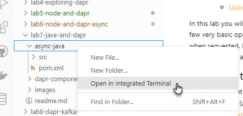
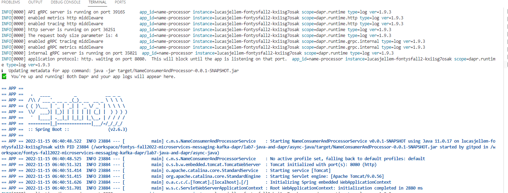
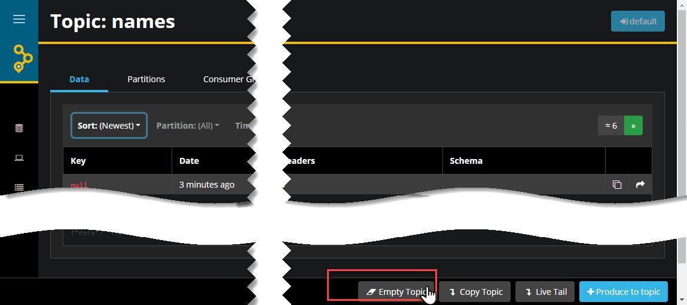
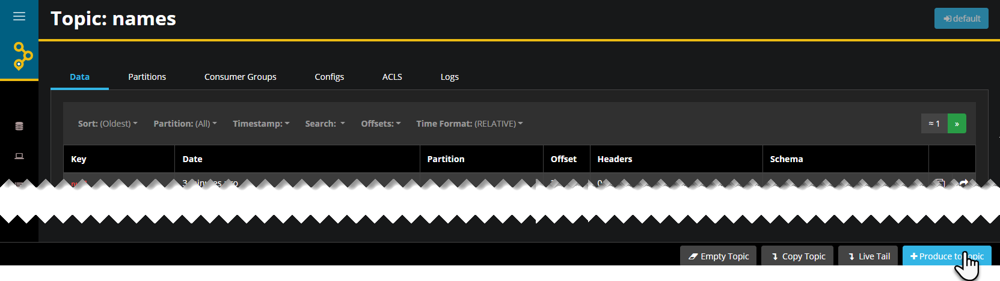
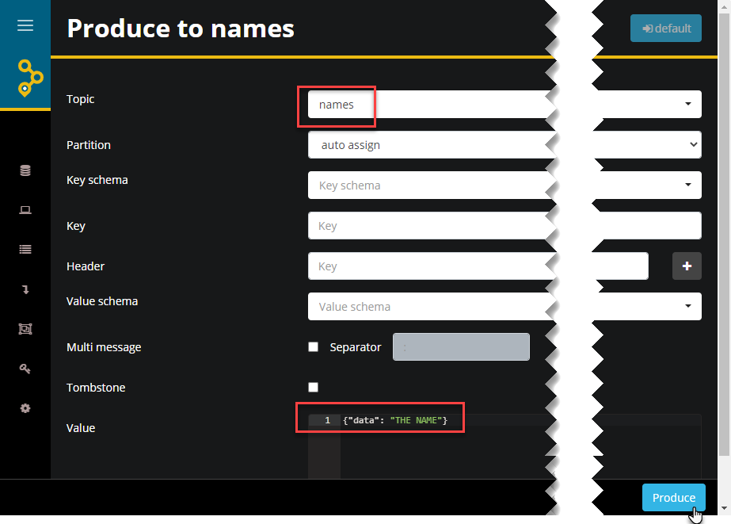
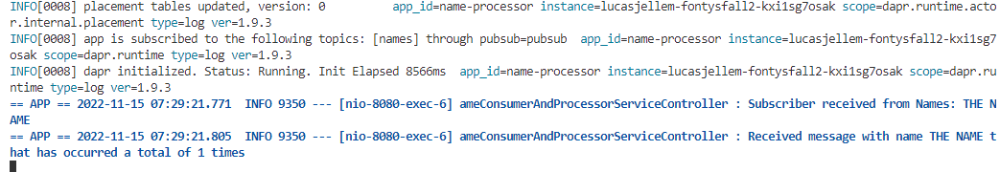
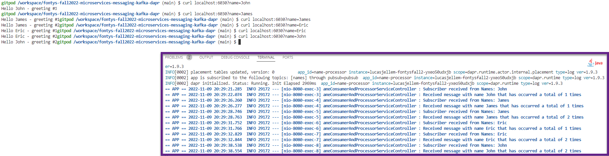
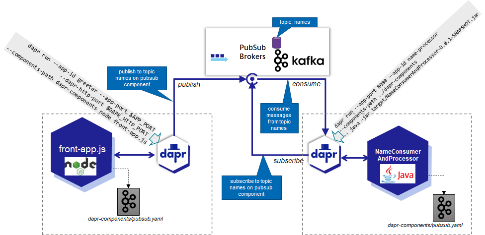

# Java and Dapr - for Asynchronous Interaction and State Store 

The previous two sections, we worked with Node. In this section we will look at how Dapr is used from Java applications. And how it helps us with asynchronous interactions aka the pubsub pattern in a similar way as we have seen in the Node application. 

The Java applicaton we implement is very similar to the Node application in `app.js`. It subscribes to the `names` topic, consumes messages, updates the statestore with the incremented count of the name occurrences. We use the same Dapr component definitions - same statestore (Redis) and same pubsub component (Apache Kafka). 

## Java and Dapr

We will be looking at directory *lab7-java-and-dapr/async-java*. It contains a pom.xml file that describes the Java application and its dependencies. It really is a very simple application. The only thing worth checking out is `/main/java/com/myacme/service/controller/NameConsumerAndProcessorServiceController.java`. This is the class that registers with Dapr as an avid listener for the topic *names* on the *pubsub* with name *pubsub*.

When an event appears on that pubsub's topic, a cloud event is constructed with a Name object as payload. The lambda function is executed and a single line with the name is written to the console.

To make this work, you need to do a few simple things.

Open a terminal for directory *lab7-java-and-dapr/async-java*.
  

Execute 

```
mvn clean install
```

This will build the Java application. Because quite a few dependencies need to be downloaded, this step will take a few minutes - but only this first time.

When the build success is reported in the console, a jar file will have been produced in the *target*  directory. It is this file that contains the Java application that consumes from the Kafka topic, supported by the Dapr Sidecar and the Dapr Java SDK to talk to the sidecar.

Now to run the Java application along with its sidecar companion, while still in the directory *lab7-java-and-dapr/async-java*, execute the following:

```
dapr run --app-port 8080 --app-id name-processor --components-path ../dapr-components -- java -jar target/NameConsumerAndProcessor-0.0.1-SNAPSHOT.jar
```

  

The Dapr Sidecar will start as well as the SpringBoot Java application. It - the sidecar - registers as a consumer on the Kafka Topic. The log file will contain an entry similar to this:

```
INFO[0003] app is subscribed to the following topics: [names] through pubsub=pubsub  app_id=name-processor instance=lucasjellem-fontysfall2-yxeo50udxjb scope=dapr.runtime type=log ver=1.9.3
```

Note: when you see errors in the logs that refer to messages that cannot be processed, there may be messages consumed by the application that do not have a proper JSON format. If that happens, you can best stop the application, empty the topic through AKHQ and restart the application. 

  

You can publish a message to the *names* topic through AKHQ:
  

Press the button Produce to Topic on the details page for the Topic *names*. Then on the page *Produce to names*, the name of the topic should be *names* and the value for the message must be a JSON message with a property *data* that contains the actual payload - in this case the name: `{data : "THE NAME"}`.

  

Once the message has been produced, the logging of the Java application should show that the message has been consumed. Note
  

Or publish a message to the Kafka topic from the commandline:

```
docker exec -ti kafkacat sh
echo "{\"data\": \"THE NAME FROM KAFKACAT\"}" | kafkacat -P -b kafka-1:19092 -t names
exit
```

Or publish the message through Dapr with the following command:

```
dapr publish --publish-app-id name-processor --pubsub pubsub --topic names --data 'COMMAND LINE ELISABETH'
```

We can also use a slightly modified of the greeter application - the Node front-app.js application that we already used in the previous section. The modification is required because the Java Dapr library expects - nay, demands - a JSON payload in the message including at least the property *data* that contains the data to be considered as the actual message payload. 

Note that we will now publish from a Node program through Dapr to Kafka and consume through Kafka to a Java application. This application is in directory *greeter-app*. To start it, open a terminal in this directory and run:
```
npm install
export APP_PORT=6030
export DAPR_HTTP_PORT=3630
dapr run --app-id greeter --app-port $APP_PORT --dapr-http-port $DAPR_HTTP_PORT --components-path dapr-components  node front-app.js 
``` 

Again, make a number of calls that will be handled by the front-app (in any terminal window):
```
curl localhost:6030?name=Michael
curl localhost:6030?name=Michael
curl localhost:6030?name=Michael
curl localhost:6030?name=Jonathan
```

The Java Application should write logging that demonstrates that the name messages are being received and processed. The responses received for the curl commands should indicate that the state - the number of occurrences of a name - is stored, because the numbers returned keep increasing (in the expected manner).

  

The overall set up we have running now is not much different from what we had in the previous section: Java has taken the place of Node for the consuming application. The Java application also uses Dapr and the overall application architecture is hardly changed at all. If anyone wants to try their hand at Python or Go - we should see a similar lack of impact.

  


## Resources

[Dapr Docs - Pub/Sub](https://docs.dapr.io/developing-applications/building-blocks/pubsub/pubsub-overview/)
[Dapr Docs - State Management](https://docs.dapr.io/developing-applications/building-blocks/state-management/state-management-overview/)
[Dapr Docs - Java SDK](https://docs.dapr.io/developing-applications/sdks/java/)
[Dapr Issue - Okta Library conflict](https://github.com/dapr/java-sdk/issues/515)

