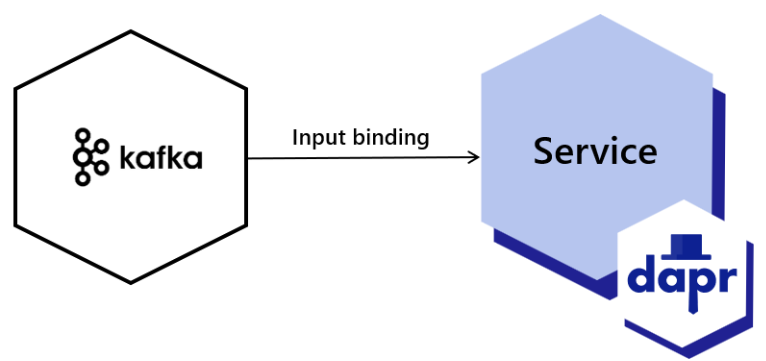
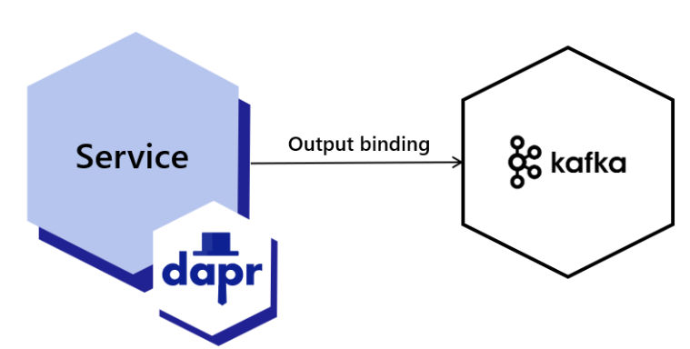
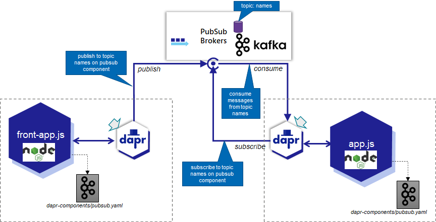
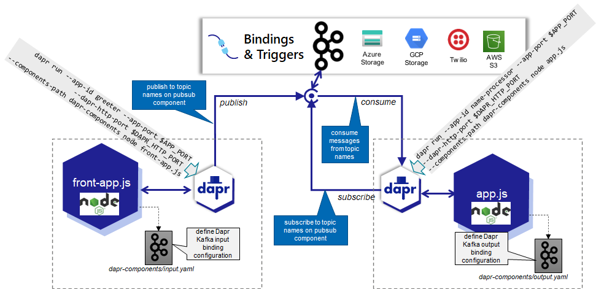
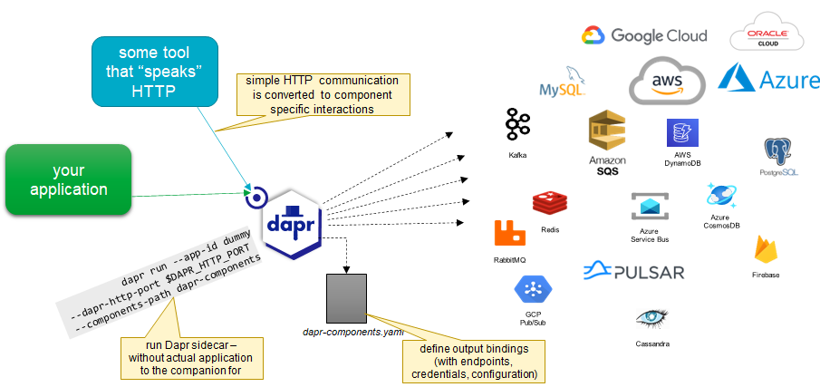
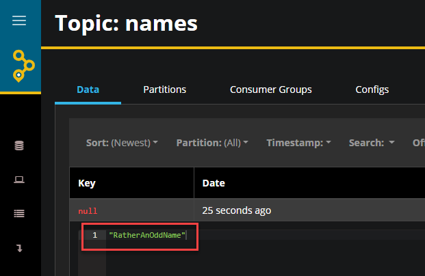
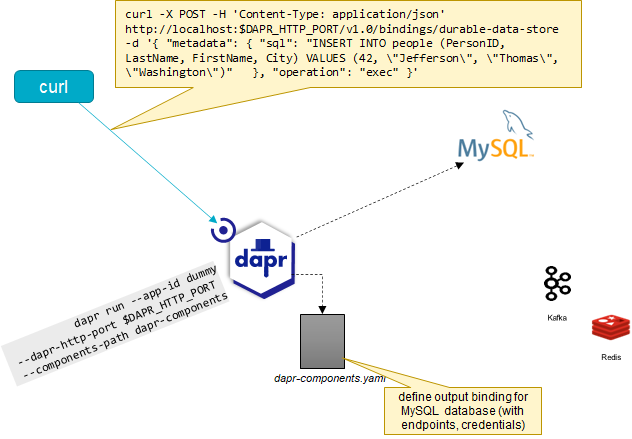

# Dapr and Kafka - More Advanced Topics

Kafka is supported in Dapr in two ways. One is as pubsub component to provide the implementation for the microservice to microservice pub/siub interaction pattern. That is what we have been using in the previous sections. There is the second option: use Dapr *bindings* to interact with Kafka. Dapr Bindings come in two flavors: input bindings (that can trigger an application through the Dapr sidecar) and output bindings (where the application takes the initiative to start the interaction). Dapr ships with Kafka Bindings in both directions. Dapr also has bindings for many other technologies - some only through an Input Binding (that can trigger a Dapr Sidecar and its application), others only with an Output Binding (where the Sidare calls out on request from its application) and some - like Apache Kafka - with both Input and Output bindings.  

Input Binding:
  

Output Binding:
  

We will reimplement the Node applications interacting with Kafka from lab 6 - this time using the Kafka Bindings in Dapr to give you a feel for working with Bindings in Dapr. The impact on the code in the applications is not huge - but there are some changes. You will find a little bit later on that working with bindings in Dapr is a uniform experience across all bindings: whether you use an output binding to retrieve a file from AWS S3 or an outout binding to create a record in a MongoDB database - your code will be quite similar. 

After switching from Kafka through Dapr PubSub to Kafka with Dapr Bindings , we implement a more interesting asynchronous use case. And we will also briefly look at a special use case where we run a Dapr Sidecar on its own, just to get access to an assistant that any application or tool that speaks either HTTP or gRPC can use for outbound operations. 

## Asynchronous Name Processing with Node and Dapr - This Time Through Bindings

In lab6 we implemented the following:

  

And now we will implement the same interactions and functionality, however instead of using Dapr PubSub to take care of the asynchronous interactions we use Dapr Bindings. This changes the diagram a little - but not too much:

  

The changes that have to made are in four files: 
* dapr-components/input.yaml
* dapr-components/output.yaml
* app.js
* front-app.js

In the first two files, the input and output bindings are configured. They are of type *bindings.kafka* and they both are configured for the same local Kafka Cluster. The input.yaml specifies the topics(s) to consume messages from and also the name of the consumer group to consume messages as. This allows us to run multiple consuming applications sharing the workload (provided the Kafka Topic is appropriately partitioned). The output.yaml file specifies the topic name to publish to. 

In front-app.js there are some small changes. No more pubsub and no more topic name. Instead a slightly more cryptic `client.binding.send` call with the name of the output binding (that indirectly refers to a Kafka Topic to publish to) and the name of the operation to execute: `create` which is fairly generic. The code in front-app.js at this point does not reveal that what it does is publish a message on a Kafka Topic. Note: a small change was made to publish a valid JSON message (when a simple String is published - not a valid JSON object - errors occur within Dapr when it sends the message to the application: * Error: fails to send binding event to http app channel, status code: 400 body: {"code":400,"message":"Unexpected token \" in JSON *).

Similarly in app.js there is no reference to a topic or to the pubsub interaction. In its place, there is again a fairly generic `await daprserver.binding.receive(NAMES_INPUT_BINDING_NAME, ..` call that is linked through the name of the input binding to the Kafka Input Binding as defined in input.yaml and thereby to the topic to consume message from and the consumer group to participate in. The code is free from dependencies on Kafka and even from consuming messages from a message broker. The exact same command would be used to be triggered by Cron, MQTT, Twitter or Zeebe job worker. Note: another small change was made in order to handle the JSON object that is now published by *front-app.js*.

To run the applications, we use the same instructions as before. Open two terminal windows for directory *lab8-dapr-kafka-advanced\hello-world-async-dapr*. In the first, run the consuming application: 

```
npm install
export APP_PORT=6031
export SERVER_PORT=6032
export DAPR_HTTP_PORT=3631
dapr run --app-id name-processor --app-port $APP_PORT --dapr-http-port $DAPR_HTTP_PORT --components-path dapr-components node app.js 
```

In the second terminal, run the *front-app* that will produce the messages to Kafka: 

```
export APP_PORT=6030
export DAPR_HTTP_PORT=3630
dapr run --app-id greeter --app-port $APP_PORT --dapr-http-port $DAPR_HTTP_PORT --components-path dapr-components  node front-app.js 
```

In a third terminal window, make a number of calls that will be handled by the front-app:
```
curl localhost:6030?name=Michael
curl localhost:6030?name=Michael
curl localhost:6030?name=William
curl localhost:6030?name=William
curl localhost:6030?name=William
curl localhost:6030?name=Kate
```

You will not see much spectacle. These calls should give you proper responses. And the logging for the two applications should indicate the processing of the HTTP request from curl and handling an input trigger respectively.

## Special Use case: Dapr as Interaction Broker

Just by configuring a binding component for Kafka and running a Dapr sidecar (even with no real application connected to it) do we get an HTTP and gRPC endpoint that can be used to interact with Apache Kafka (or any other component that Dapr supports with an output binding component). The ability to expose complex interactions (communication protocol, connection management, message format) through simple HTTP interaction may be useful for example for automated test scenarios or data engineering activities)

  

If you want to use curl to interact with MongoDB, Azure Blob Storage, Twitter, GCP Pub/Sub, Apple Push Notifications then that can easily be arranged. Configure the destination as a Dapr output binding component, run the Dapr sidecar and interact over local http from curl to the sidecar in order to have the sidecar do the actual interaction with the special component you want to target,

```
export DAPR_HTTP_PORT=6300
dapr run --app-id dummy --dapr-http-port $DAPR_HTTP_PORT --components-path /workspace/fontys-fall2022-microservices-messaging-kafka-dapr/lab8-dapr-kafka-advanced/hello-world-async-dapr/dapr-components
```

This next call - in any terminal window - is now enough to publish a message on the Kafka *names* topic:

```
export DAPR_HTTP_PORT=6300
curl -X POST -H 'Content-Type: application/json' http://localhost:$DAPR_HTTP_PORT/v1.0/bindings/names-output -d '{ "data": "RatherAnOddName", "operation": "create" }'
```

You can check in the logging for the *app,js* application to see the name being received and processed and you can check in the AKHQ browser UI for confirmation.
  

### Dapr Output Binding for MySQL

Another example - interact with MySQL from curl through Dapr and an output binding:

A MySQL Database is already running in a Docker container called *dapr-mysql*. To connect to this MySQL server from the MySQL client application from inside the container running MySQL:

```
docker exec -it dapr-mysql mysql -uroot -p
```

and type the password: `my-secret-pw`

You can list the databases:
```
show databases;
```

Create a new database called *specialdata*, use the database and create a table:

```
create database specialdata;
use specialdata;
CREATE TABLE people (
    PersonID int,
    LastName varchar(255),
    FirstName varchar(255),
    City varchar(255)
);
```

The table is now prepared. The next step is to prepare the Dapr output binding for interaction with this MySQL database *specialdata*. Add this definition at the end of the *output.yaml* file in directory *lab8-dapr-kafka-advanced/hello-world-async-dapr/dapr-components*:

```
---
apiVersion: dapr.io/v1alpha1
kind: Component
metadata:
  name: durable-data-store
spec:
  type: bindings.mysql
  version: v1
  metadata:
  - name: url
    value: "root:my-secret-pw@tcp(localhost:3306)/specialdata?allowNativePasswords=true"
```

Stop the Dapr sidecar you started before in this section and start it again with the same command as before:
```
export DAPR_HTTP_PORT=6300
dapr run --app-id dummy --dapr-http-port $DAPR_HTTP_PORT --components-path /workspace/fontys-fall2022-microservices-messaging-kafka-dapr/lab8-dapr-kafka-advanced/hello-world-async-dapr/dapr-components
```

This next call - in any terminal window - is now enough to insert a record in the MySQL people table:

```
export DAPR_HTTP_PORT=6300
curl -X POST -H 'Content-Type: application/json' http://localhost:$DAPR_HTTP_PORT/v1.0/bindings/durable-data-store -d '{ "metadata": { "sql": "INSERT INTO people (PersonID, LastName, FirstName, City) VALUES (42, \"Jefferson\", \"Thomas\", \"Washington\")"   }, "operation": "exec" }'
```

Note how the URL refers to the name of the binding that was defined in the *output.yaml* file (*durable-data-store*). This tells the Dapr Sidecar which component to target (the MySQL database) with this *exec* operation.

After making this call, return to the terminal where you are still hovering in the MySQL client and execute:

```
select * from people;
```

to hopefully find that the record for Thomas Jefferson has been created. By defining the output binding for the MySQL database, the Dapr Sidecar now can connect and execute our SQL statements that we submit through simple HTTP calls.  

  

Querying data can also be done with curl through Dapr sidecar:

```
export DAPR_HTTP_PORT=6300
curl -X POST -H 'Content-Type: application/json' http://localhost:$DAPR_HTTP_PORT/v1.0/bindings/durable-data-store -d '{ "metadata": { "sql": "select * from people"   }, "operation": "query" }'
```

## Resources

[Dapr Docs - Kafka Binding Spec](https://docs.dapr.io/reference/components-reference/supported-bindings/kafka/)
[Dapr Docs - How to Input Bindings](https://docs.dapr.io/developing-applications/building-blocks/bindings/howto-triggers/)
[Dapr Docs - How To Output Bindings](https://docs.dapr.io/developing-applications/building-blocks/bindings/howto-bindings/)
[Dapr Docs - MySQL Output Binding](https://docs.dapr.io/reference/components-reference/supported-bindings/mysql/)