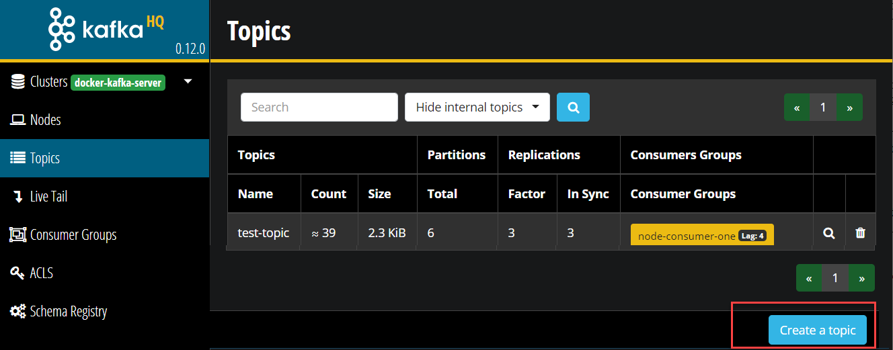

# Lab - DIY CQRS using Apache Kafka
In the previous labs, you have explored interacting with Kafka from Node through Dapr. The applications produced to Kafka Topics and consumed messages from Kafka Topics - although with the use of Dapr, no direct dependencies on Kafka appeared in the Node application code. 

In this lab, we are going one step further to implement a fairly realistic use case. The context is a utility company. It is starting out with Smart Meters in the field and an IoT Platform to collect readings from those meters. In order to be allowed to collect readings from a meter associated with a connection (gas, heat or electricity), a customer needs to provide a mandate to the utility company. Such a mandate either grants permission to read with high frequency (semi real time) or to read once a month, only for the purpose of calculating the bill. If no mandate is issued by the customer, then no readings can be collected from the meter.

These connection mandates - along with all other information regarding customers, such as their address and contact details are managed by the CRM microservice. This service manages the state of customer related data. It handles REST API calls that post new customer related data and it responds to REST API calls requesting data on customers. Note: we will not discuss security and GDPR related details at this point.

Some of the data managed by the CRM service is needed by the *IoT Platform service* - to know if data from a certain Smart Meter associated with a specific connection can be collected or not. We want microservices to be as independent as possible. We do not want to have the successful operation of either service depend on the current availability of the other service. We do not even want services to know about other services if they do not really have to.

It has been decided therefore by the architects in this utility company that a new *domain event* has been identified: the *Connection Mandate event* that has a simple payload with just two fields: the *connection identifier* and the *mandate level* (0, 1 or 2 for no mandate, billing only or real-time reading). The team that owns the CRM service is instructed to publish the Connection Mandate event to a Kafka Topic - whenever the mandate settings for a customer change. The IoT Platform team is likewise advised to consume events from the same Kafka Topic and use these events to construct an actual overview of the mandate settings for all connections (gas, electricity or heat) they want to collect smart meter readings from.

  

In this lab, you will implement and run both microservices and create the Kafka Topic that provides the decoupled bridge between the two. The microservices will leverage Dapr for their interaction with Kafka (and perhaps the event broker will not be Kafka after all for all they know)

Steps
* CRM Microservice to handle REST calls with data read and manipulation requests; the CRM Microservice loads initial data from a CSV file and it currently does not write any changes in the state of its data
* Create Kafka Topic for *Connection Mandate* events 
* Extend CRM Microservice with publication of Connection Mandate messages to Kafka Topic
* Create IoT Platform Microservice that handles REST GET requests for the Mandate setting for a specific connection - initially without any Mandate data
* Extend IoT Platform Microservice with consumption of Connection Mandate messages from the corresponding Kafka Topic and use them to build the actual state of Connection Mandates - storing this state in the statestore
* Experiment with stopping and starting the IoT Platform Microservice and its ability to retain or regain its state 
* Switch from statestore implementation for the IoT Platform microservice - without losing data


## CRM Microservice 
Focus on the directory *CRM* in the lab folder. Here is where the CRM Service sources are.

The main service is defined in *app.js*. It uses the core Node *http* module that we have seen before. Using this module, it starts an HTTP Server, listening at PORT 3005 for GET and POST requests to read customer records or write new or modified customer records.

The *customers* object in *app.js* is the store of customers - the simple in-memory alternative to a real data store (such as NoSQL database or relational database or even an in-memory cache). We use the customer identifier as the key for storing and locating customers in this object.

When *app.js* is started, it runs function *importCustomers* from the *importer* module (file *importer.js*). This function reads the csv-file *customer-database.csv*, a simple comma separated values file with imaginary customer records. Each record read by *importCustomers* from this file is turned into a JavaScript object; the names of the properties of this object are taken from the field names in the header record in the CSV file. In the call to *importCustomers*, function reference is passed to a function that can handle customer objects. Using the *forEach* operator on the *customers* array, this function is invoked for each customer record that is read from the file.

Function *processCustomer* is defined in *app.js* and is passed to the *importCustomers* function. It adds new customer records to the *customers* collection of customers. For new customer records without identifier, it generates a new customer id value - with one added to the highest current customer identifier.  

Function *handleGetCustomer* is invoked to handle GET requests for retrieving customer information. The function can handle a request with a query parameter *customerId* to retrieve details for a single customer. A GET request with no query parameters return a full list - in JSON format - of all customers managed by the CRM service.  

Install the dependencies for the CRM service and run the service from the command line in the *lab9-diy-cqrs\CRM* directory:
```
npm install
export APP_PORT=3005
npm start
```
On the console, you should see log output indicating that the CSV file is read and processed.

### Make HTTP Calls to the CRM Microservice
Using  cURL or wget you can try to get in touch with the CRM Microservice. For example to request details on a customer with identifier 42, make the following call:
``` 
curl  http://localhost:$APP_PORT?customerId=42 -v
```
You should find the console logging of the CRM service that the request was received, and you should see a response from it whose details are written to the command line by cURL. Defining appropriate status codes and messages go a long way in making the use of APIs a more pleasant experience. Try leaving out the customerId parameter; this should return a list of all customers.

  

Now try making a request for customer identifier with which real customer data is associated:
``` 
curl  http://localhost:$APP_PORT?customerId=2 -v
```
To create a new customer, use this call with cURL:
```
curl POST http://localhost:$APP_PORT/customers -H "Content-Type: application/json" -d '{    "firstName": "Molly",    "lastName": "Peterson",    "city": "Zeewolde",    "connectionId": "928",   "connectionMandate": "0"}' -v
```

A new customer is created and the response to this request should indicate the newly assigned customer identifier. Of course you can subsequently GET the details for this new customer, by using that identifier.

## Create Kafka Topic for Connection Mandate settings 

The CRM Service is running and it is handling new customers as well as changes to existing customers. The next step to take is to make the CRM service inform the enterprise (IT landscape) of these customer related events. And the first step in realizing this requirement is the creation of a Kafka Topic onto which these events can be published.

Either through the AKHQ GUI or from the command line in one of the Kafka Broker containers create the new Kafka Topic - called *connection-mandates-topic* topic with 4 partitions and a replication factor of 2. From the command line, this works like this:

```
docker exec -ti kafka-1 bash
```
Now let's create a new topic. For that we use the **kafka-topics** utility with the `--create` option. Create a *connection-mandates-topic* topic with 4 partitions and a replication factor of 2.  

```
kafka-topics --create --if-not-exists --zookeeper zookeeper-1:2181 --topic connection-mandates-topic --partitions 4 --replication-factor 2
```
Run this command to list the topics.

```
kafka-topics --list --zookeeper zookeeper-1:2181
```
You should see the new topic you have just created. 

Note: you can also create a new topic on the *Topics* page in AKHQ



## Extend CRM Microservice with event publication to connection-mandates-topic

  

Add this next line at the top of *app.js*; this imports module producer, defined in file *produce.js*. This module provides the bridge to the Kafka Topic.
``` 
import { produceMessage } from './produce.js';
```
Look at the contents of *produce.js*: simply publishing a message using Dapr PubSub.

Now whenever the CRM service registers a completely new customer, it should publish a message to the new *connection-mandates-topic* . And when for and existing customer anything changes in the values of connectionId or connectionMandate, then too should a message be published to the topic. 

The function that processes both new and changed customers is function *processCustomer* in *app.js*. It is from this function therefore that the function *producer.produceMessage* is to be invoked with a message payload that looks like this:
```
{ "connectionId":"4617", "connectionMandate" : "1" }
```
Add the following lines near the end of the function, just before the return statement:
```
    // check if the either the customer is new or the mandate settings has changed; in both cases: an event needs to be produced
    if (!oldCustomer || (oldCustomer.connectionId != customerObject.connectionId) || (oldCustomer.connectionMandate != customerObject.connectionMandate)) {
        produceMessage(JSON.stringify({ "connectionId": customerObject.connectionId, "connectionMandate": customerObject.connectionMandate }))
    }
```
Run the application again, using the following command: 

```
export APP_PORT=3005
export DAPR_HTTP_PORT=3905
    dapr run --app-id crm --app-port $APP_PORT --dapr-http-port $DAPR_HTTP_PORT  --components-path dapr-components node app.js
```


In the console output, there should be messages telling you about messages that are produced to the new Kafka Topic *connection-mandates-topic*.

When you register a new customer with the CRM service - a message will be published to the Kafka Topic as well. Try this out with this call with cURL:
```
export APP_PORT=3005
curl POST http://localhost:$APP_PORT/customers -H "Content-Type: application/json" -d '{    "firstName": "Molly",    "lastName": "Peterson",    "city": "Zeewolde",    "connectionId": "928",   "connectionMandate": "0"}' -v
```

You can easily check the messages currently on the Kafka Topic in the Apache Kafka HQ GUI: http://kafka:28042/docker-kafka-server/topic/connection-mandates-topic .


## IoT Platform Microservice 
Let us turn our attention to the IoT Platform microservice in directory *IoTPlatform*. In real life, it would do many things However, for this lab we will focus on just one feature: it returns the connection mandate level (0, 1 or 2) for a given connection identifier, when asked in a simple HTTP GET Request. This feature is implemented in the Node application that has *app.js* as its core component.

Check the contents of *app.js*. You should be able by now to quickly recognize the HTTP Server that is started, listening at Port 3006. The server is configured to handle GET requests - and it only handle requests with a query parameter named *connectionId*.

It will check for the value in the state store for the connectionId. The statestore will initially be empty and in the current state of the application, it will always remain empty. Therefore, any request at present will end up in a 404 HTTP response status: resource not found.

Note that the statestore is based on Redis - as defined through the statestore name in the code (*statestore*) and the definition in the *statestore.yaml* file.
 
Install the dependencies for the IoT Platform microservice and run the service from the command line in the *lab9-diy-cqrs\IoTPlatform* directory:
```
npm install
export APP_PORT=3008
export DAPR_HTTP_PORT=3908
dapr run --app-id iot-platform --app-port $APP_PORT --dapr-http-port $DAPR_HTTP_PORT  --components-path dapr-components node app.js
```

  

Now try making a request for a connection identifier that exists in the *customer-database.csv* file - for which currently no mandate is known in the microservice:
``` 
export APP_PORT=3008
curl  http://localhost:$APP_PORT?connectionId=7733 -v
```
You will receive an HTTP 404 response status - as well you should. You may want to try a request with query parameter at all - just for kicks.

And now on to more serious business: consuming Connection Mandate messages into the IoT Platform microservice.

## Extend IoT Platform Microservice with consumption of Connection Mandate messages

When the IoT Platform microservice is started, we want it to register as a consumer on the Kafka topic *connection-mandates-topic*. The directory *dapr-components* contains the file *pubsub.yaml* that defines the required pubsub component - with the configuration set up for the local Kafka cluster. 

File *app.js* already defines the constants PUBSUB_NAME and TOPIC_NAME the DaprServer object is already imported. All we need to do now is to initialize the DaprServer and create a subscription on the topic at the pubsub component. And specify what needs to be done when messages arrive from this subscription. 

Add - or uncomment - this code, under the definition of the daprclient:

```
async function main() {
  const server = new DaprServer(SERVER_HOST, SERVER_PORT, DAPR_HOST, DAPR_HTTP_PORT);
  // Dapr subscription routes orders topic to this route
  server.pubsub.subscribe(PUBSUB_NAME, TOPIC_NAME, async (data) =>  {
    console.log("Subscriber received: " + data)
    let connectionMandate = JSON.parse(data)
    // save connectionMandate to the statestore
    const response = await daprclient.state.save(STATESTORE_NAME, [
        {
            key: connectionMandate.connectionId,
            value: connectionMandate
        }
    ]);
  }
    );

  await server.start();
}

main().catch(e => console.error(e));
```

This code creates a DaprServer and a subscription on TOPIC_NAME in PUBSUB_NAME. When a message arrives, its content is written to the console first and then the message is stored in the statestore - using the connectId as the key. This statestore is private to the IoT Platform microservice. It is kept in sync with the connection mandate data in CRM because of the messages produced from CRM to Kafka and consumed and processed (in a decoupled way) by the IoT Platform microservice. 

  

Start the IoT Platform microservice again, using
```
export APP_REST_PORT=3008
export APP_PORT=5002
export DAPR_HTTP_PORT=3908
dapr run --app-id iot-platform --app-port $APP_PORT --dapr-http-port $DAPR_HTTP_PORT  --components-path dapr-components node consume.js
```
What you should see happening now is that after a few seconds the HTTP Server reports for duty - listening on Port 3008. And shortly after that, messages are consumed from the Kafka Topic (and processed into the statestore)  - even though none are being published at the moment. Try to understand which messages are consumed when the microservice is started. Hint: check the pubsub.yaml file in the dapr-components directory.

At this time, we can again attempt to retrieve the connect mandate status from the IoT Platform service for a specific connection identifier:
``` 
export APP_REST_PORT=3008
curl  http://localhost:$APP_REST_PORT?connectionId=7733
```
This time you should get a connection mandate setting. Its level is probably 1 - because that is how it is defined in the *customer-database.csv* file.

The Zipkin dependency overview shows this new trace based flow:

      

When you now change the connection mandate for this connection identifier in CRM, this change should rapidly be available in the IoT Platform service as well. Try this out with this call with cURL to the CRM API:
```
export APP_PORT=3005
curl POST http://localhost:$APP_PORT/customers/7 -H "Content-Type: application/json" -d '{    "firstName": "Corinne",    "lastName": "Lopez",    "city": "Enschede",    "connectionId": "7733",   "connectionMandate": "2"}' -v
```

This call updates the mandate level from 1 to 2. Now when you ask the IoT Platform service for the mandate level for connection identifier 7733, it should tell you the actual value of 2.

``` 
export APP_REST_PORT=3008
curl  http://localhost:$APP_REST_PORT?connectionId=7733
```

Here we see more evidence of the fact that changes in connection mandates are reported from the CRM service and are absorbed by the IoT Platform service. And these two services know nothing about each other.  

## Experiment with stopping and starting the IoT Platform Microservice 

Stop the IoT Platform microservice.

Now start it again. 

```
export APP_REST_PORT=3008
export APP_PORT=5002
export DAPR_HTTP_PORT=3908
dapr run --app-id iot-platform --app-port $APP_PORT --dapr-http-port $DAPR_HTTP_PORT  --components-path dapr-components node app.js
```

From the logging, it is clear that no messages are consumed (unless you change the name of the consumer group in the pubsub.yaml file). However, the IoT Platform service manages its own local data store and the information from the messages processed earlier is stored in the statestore. When at this point you retrieve the mandate level once more for connection identifier 7733, it will be the level you set it at most recently: 2 (rather than 1 as defined in the CSV file)
``` 
export APP_REST_PORT=3008
curl  http://localhost:$APP_REST_PORT?connectionId=7733
```

What you see here is quite important: the microservice can be stopped and started again and multiple instances of the microservice can run side by side (scale out or scale horizontally) and they will all have access to the same data.

Stop the IoT Platform service once more. Let's now update the mandate level for a different connection identifier - 4512 - from 0 to 2

```
export APP_PORT=3005
curl POST http://localhost:$APP_PORT/customers/5 -H "Content-Type: application/json" -d '{    "firstName": "Markus",    "lastName": "Berg",    "city": "Maassluis",    "connectionId": "4512",   "connectionMandate": "2"}' -v
```

Verify the successful processing of this command, by inspecting the actual state of the customer record:
``` 
curl  http://localhost:$APP_PORT?customerId=5 -v
```
Now start the IoT Platform service again. It was not up and running while we made the update to the the Markus Berg record. When we now ask the IoT Platform Service for the mandate level for Markus Berg, do we get the level specified in the customer-database.csv file (0) or the level it was set to through the CRM service when the IoT Platform service was not running?

``` 
export APP_REST_PORT=3008
curl  http://localhost:$APP_REST_PORT?connectionId=4512
```

The result should be 2 - the level it was set to most recently. The message describing this update is the most recent message on the Kafka Topic and should be processed last when the IoT Platform service restarted. 

### Restarting the CRM service

Now you may wonder what would happen if you restart the CRM service? Go ahead. Stop the CRM service and restart it:

```
export APP_PORT=3005
export DAPR_HTTP_PORT=3905
dapr run --app-id crm --app-port $APP_PORT --dapr-http-port $DAPR_HTTP_PORT   --components-path dapr-components node app.js
```

Now retrieve the mandate setting from the IoT Platform-service for connection identifier 7733 - the one that was updated to 2 through the CRM service earlier on:

``` 
export APP_REST_PORT=3008
curl  http://localhost:$APP_REST_PORT?connectionId=7733
```

What happened when you restarted the CRM service is that it reloaded the *customer-database.csv* file and produced messages for each of the records. In this file, the mandate level for the connection identifier is 1. The readjustment to 2 was published to the Kafka Topic but not written to the CSV file. It did not become a persistent part of the state of the CRM service. The message on the Kafka Topic stating the mandate level at 1 - produced as the CRM service was restarting - has overridden the earlier message on the topic that declared the mandate level for 7733 to be 2. 

### Bonus: Scakling Out by Running a Second IoT Platform Application

Can you make this happen? Running two IoT Platform Application instances - that share the workload. Each processing about half of the messages published by the CRM microservice. Would it be hard to make this reality?

Hint: consumer group. Hint 2: dapr-components/pubsub.yaml. 

Give it a try!
### Bonus: Switching to MySQL and Restoring the Statestore

When something happens with the Redis container that implements the statestore for the IoT Platform microservice, then all connection mandate data is lost. Or when we switch to MySQL as the provider of the statestore. However, all messages that were used to create the data in that store are still available in the Kafka Topic. The statestore can be restored!

Let's try that out.

Try once more to retrieve from the IoT Platform microservice the details for a specific connection:
``` 
export APP_REST_PORT=3008
curl  http://localhost:$APP_REST_PORT?connectionId=7733
```

Open file *app.js* and change the value of the const STATESTORE_NAME from *statestore* to *durable-statestore*. 

```
const STATESTORE_NAME = "durable-statestore";
```

This *durable-statestore* is defined in file *statestore.yaml* in the directory *dapr-components* and refers to the MySQL provider. Stop the IoT Platform microservice and start it again.

```
export APP_REST_PORT=3008
export APP_PORT=5002
export DAPR_HTTP_PORT=3908
dapr run --app-id iot-platform --app-port $APP_PORT --dapr-http-port $DAPR_HTTP_PORT  --components-path dapr-components node app.js
```

  

Try again to retrieve from the IoT Platform microservice the details for a specific connection:
``` 
export APP_REST_PORT=3008
curl  http://localhost:$APP_REST_PORT?connectionId=7733
```

This time the response is empty. This connection is not available. And no connection is - because the microservice is running with a fresh and empty statestore. Now we will use a trick to reconsume all messages on the *connection-mandates-topic* Kafka Topic. 

Open file *pubsub.yaml* in the directory *dapr-components*. Change the value for the entry *consumerGroup*. For example by adding a number to the current value *iot-platform-consumer*, 

Stop the IoT Platform microservice and start it again.

```
export APP_REST_PORT=3008
export APP_PORT=5002
export DAPR_HTTP_PORT=3908
dapr run --app-id crm --app-port $APP_PORT --dapr-http-port $DAPR_HTTP_PORT  --components-path dapr-components node app.js
```

The messages in the logging tell you the story: messages from the Kafka Topic are consumed from the beginning - because of the changed consumer group name and still the setting of *initialOffset* - and the data from these messages is saved to the state store, which by now is the MySQL database.   

Try again to retrieve from the IoT Platform microservice the details for a specific connection:
``` 
export APP_REST_PORT=3008
curl  http://localhost:$APP_REST_PORT?connectionId=7733
```

And now there should be a result - based on the Kafka messages, the MySQL statestore is populated and the microservice can return the connection mandate details from the statestore.


